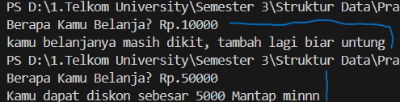
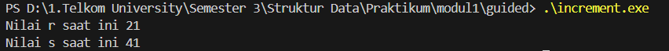
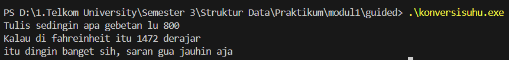
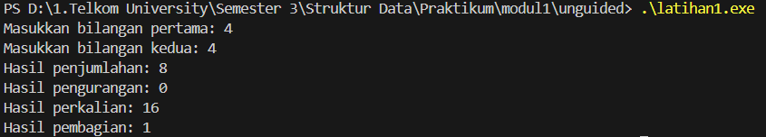
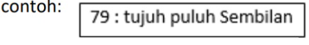
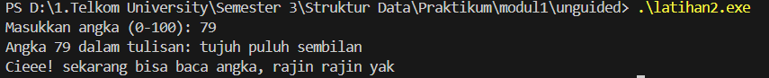
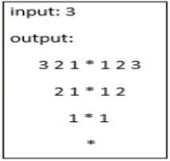
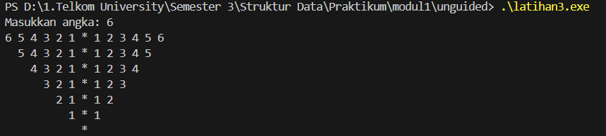

<h1 align = center > <b>  LAPORAN PRATIKUM STUKTUR DATA PERTEMUAN 1 <br>
</b></h1><p align = center><b>Nama : Alvin Aldino Rahmatullah || NIM : 103112430283 || Kelas : IF-12-05</b></p>

<h1> 1. Motivasi Belajar Struktur Data </h1>
Saya merasa mempelajari struktur data adalah pondasi awal untuk mengelola dan memahami informasi. Dengan memahami struktur data dengan baik saya merasa nantinya akan mudah menyusun program yang lebih efisien dan mampu menyelesaikan permasalahan nyata yang dihadapi, seperti pengolahan data pada aplikasi, layanan digital dan program yang mempermudah kegiatan sehari hari

<h1> 2. Dasar Teori </h1>
Pada pertemuan pertama saya hanya perlu mengulang basic program seperti penentuan variabel, struktur program, dan mengenal bahasa pemograman C++ yang akan dipakai dalam proyek semester 3 kedepan.

C++ adalah bahasa pemrograman yang terkenal dengan efisiensinya. Bahasa ini diciptakan untuk melengkapi bahasa pemrograman C, dan mampu menangani aplikasi berperforma tinggi, seperti game dan sistem operasi. Selain itu, C++ juga mendukung berbagai gaya pemrograman dan sangat fleksibel. Programmer bisa mengatur penggunaan memori secara langsung, menjadikan C++ cocok untuk proyek kecil maupun besar dan banyak dipakai di berbagai industri teknologi.

karena C++ merupakan peluasan dari Bahasa Pemrograman C yang tergolong dalam Bahasa Pemrograman Tingat Menengah (Middle Level Language), yang berarti Bahasa Pemrograman C++ memiliki semua fitur dan kelebihan yang bahasa pemrograman C miliki, termasuk kelebihan Bahasa C yaitu kita dimungkinkan untuk menggunakan Bahasa Pemrograman Assembly di dalam pengkodingan C, dan juga menyediakan fasilitas untuk memanipulasi memori tingkat rendah.

C++ adalah peluasan dan penyempurnaan dari bahasa pemrograman sebelumnya yaitu bahasa C, oleh Bjarne Stroustrup pada tahun 1980. Awal C++ mempunyai nama yaitu “C with Classes” dan berganti nama menjadi C++ pada tahun 1983. Bjarne Stroustrup membuat bahasa pemrograman C++ dengan tambahan fasilitas, yang sangat berguna pada tahun itu sampai sekarang, yaitu bahasa pemrograman yang mendukung OOP (Object Oriented Programming).

<h1> 3. Guided </h1>

### 3.1 Guided 1 (Discount)

**-Code Program-**

```cpp
#include<iostream> // library untuk input dan output

using namespace std; 

int main(){
    double total_pembelian, diskon; // variabel untuk simpan total belanja dan diskon
    cout<<"Berapa Kamu Belanja? Rp."; // Menanyai user total belanja
    cin>>total_pembelian; // user memasukkan total belanja

    // program akan cek apakah total belanja lebih dari 30000
    if(total_pembelian>30000){
        diskon=0.1*total_pembelian; // jika ya maka hitung diskon 10%
        cout<<"Kamu dapat diskon sebesar "<<diskon<<" Mantap minnn"; // dan menampilkan diskon
    }else{
        cout<<"kamu belanjanya masih dikit, tambah lagi biar untung"; // Tapi kalau belanja kurang dari 30000, maka program meminta tambah belanja dan tidak dapat diskon.
    }

    return 0; 
}
```
**-Penjelasan Umum-**
ini adalah sebuah program yang bisa dipakai dalam kasir toko atau tempat berbelanjaan lainnya, karena program ini berfungsi untuk cek apakah sebuah pembelian akan mendapatkan diskon dan jika ya program akan langsung menghitung total belanja yang didapatkan oleh pelanngan.

**-Output-**


### 3.2 Guided 2 (Increment)

**-Code Program-**

```cpp
#include<iostream> // library untuk input dan output

using namespace std;

int main(){
    int r=20; // inisialisasi variabel r dengan nilai awal 20
    int s;    // deklarasi variabel s yang belum ada nilai

    s=20 + ++r; // prosesnya itu r ditambah dulu jadi 21, lalu s = 20 + 21 = 41
    cout<<"Nilai r saat ini "<<r<<endl; // menampilkan nilai r (21)
    cout<<"Nilai s saat ini "<<s<<endl; // menampilkan nilai s (41)

    return 0;
}

```
**-Penjelasan Umum-**
Program ini merupakan contoh sederhana penggunaan operator increment (++r) dalam bahasa C++. Program akan mendeklarasikan variabel r dengan nilai awal, lalu melakukan operasi aritmatika menggunakan pre-increment. Hasil akhirnya adalah menampilkan nilai terbaru dari r setelah ditambah, serta nilai s yang merupakan hasil perhitungan dari ekspresi aritmatika. Program ini berguna untuk memahami bagaimana operator increment bekerja dalam pengolahan data numerik pada pemrograman.

**-Output-**


### 3.3 Guided 3 (Konversi suhu)

**-Code Program-**

```cpp
#include<iostream> // Library standar untuk input dan output

using namespace std;

int main(){
    float celcius, fahreinheit; // deklarasi variabel untuk menyimpan suhu celcius dan fahrenheit

    cout<<"Tulis sedingin apa gebetan lu"; // program menanyakan suhu dalam celcius dan user akan menjawab
    cin>>celcius; // user memasukkan nilai suhu dalam celcius

    fahreinheit=(9.0/5.0)*celcius+32; // rumus konversi celcius ke fahrenheit

    cout<<"Kalau di fahreinheit itu "<<fahreinheit<<" derajar"<<endl; // tampilkan hasil konversi 
    cout<<"itu dingin banget sih, saran gua jauhin aja"; // teks untuk suruh menjauh dari gebetan wkwk

    return 0;
}

```
**-Penjelasan Umum-**
Program ini merupakan contoh sederhana konversi suhu dari Celcius ke Fahrenheit. Program akan meminta pengguna untuk memasukkan suhu dalam satuan Celcius, kemudian melakukan perhitungan menggunakan rumus konversi (9.0/5.0) * celcius + 32. Hasil akhirnya adalah menampilkan suhu dalam satuan Fahrenheit. Program ini bermanfaat untuk menjauhi gebetan.

**-Output-**



## 4. Unguided

### 4.1 Unguided 1

**-Soal 1-**

Buatlah program yang menerima input-an dua buah bilangan bertipe float, kemudian memberikan output-an hasil penjumlahan, pengurangan, perkalian, dan pembagian dari dua bilangan tersebut

**-Code Program-**

```cpp
#include <iostream>

using namespace std;

int main(){
    float a, b, tambah, kurang, kali, bagi; // mendeklarasikan seluruh variabel yang digunakan
    cout<<"Masukkan bilangan pertama: ";
    cin>>a; // input bilangan pertama ke dalam variabel a
    cout<<"Masukkan bilangan kedua: ";
    cin>>b; // input bilangan kedua ke dalam variabel b

    // proses penghitungan input a dan input b. Memasukkan hasil ke dalam variabel tambah, kurang, kali, dan bagi
    tambah = a + b;
    kurang = a - b;
    kali = a * b;
    bagi = a / b;

    // output hasil keseluruhan operasi
    cout<<"Hasil penjumlahan: "<<tambah<<endl;
    cout<<"Hasil pengurangan: "<<kurang<<endl;
    cout<<"Hasil perkalian: "<<kali<<endl;
    cout<<"Hasil pembagian: "<<bagi<<endl;

    return 0;
}

```
**-Penjelasan Umum-**
ini adalah program sederhana operasi aritmatika atau perhitungan dasar dalam bahasa c++. Program Program akan meminta pengguna untuk memasukkan dua buah bilangan, kemudian menghitung hasil penjumlahan, pengurangan, perkalian, dan pembagian dari bilangan tersebut. Hasil perhitungan ditampilkan kembali ke layar. Program ini bermanfaat untuk memahami penggunaan variabel bertipe float, input/output, serta operator aritmatika dasar dalam pemrograman.

**-Output-**


### 4.2 Unguided 2

**-Soal 2-**

**-Code Program-**
Buatlah sebuah program yang menerima masukan angka dan mengeluarkan output nilai angka tersebut dalam bentuk tulisan. Angka yang akan di-input-kan user adalah bilangan bulat positif mulai dari 0 s.d 100.


```cpp
#include <iostream>
#include <string>

using namespace std;

int main(){
    int angka;  // variabel untuk menyimpan input angka dari user
    
    cout << "Masukkan angka (0-100): ";  // prompt untuk userc agar input
    cin >> angka;  // menerima input angka dari user
    
    // validasi input harus antara 0 sampai 100
    if(angka < 0 || angka > 100){
        cout << "Angka harus antara 0 sampai 100!" << endl;
        return 0;  // keluar program jika input tidak valid
    }
    
    // array untuk menyimpan nama angka 0-9
    string satuan[] = {"nol", "satu", "dua", "tiga", "empat", "lima", 
                      "enam", "tujuh", "delapan", "sembilan"};
    
    string hasil;  // variabel untuk menyimpan hasil konversi
    
    // penanganan untuk angka 0
    if(angka == 0){
        hasil = satuan[0];
    }
    // penanganan untuk angka 100 (khusus)
    else if(angka == 100){
        hasil = "seratus";
    }
    // penanganan untuk angka 1-9
    else if(angka >= 1 && angka <= 9){
        hasil = satuan[angka];
    }
    // penanganan untuk angka 10 (khusus)
    else if(angka == 10){
        hasil = "sepuluh";
    }
    // penanganan untuk angka 11 (khusus)
    else if(angka == 11){
        hasil = "sebelas";
    }
    // penanganan untuk angka 12-19 (angka belasan)
    else if(angka >= 12 && angka <= 19){
        hasil = satuan[angka % 10] + " belas";  // ambil satuan + "belas"
    }
    // penanganan untuk angka 20-99 (angka puluhan)
    else if(angka >= 20 && angka <= 99){
        int puluhan = angka / 10;  // mendapatkan digit puluhan
        int sisa = angka % 10;     // mendapatkan digit satuan
        
        // konversi digit puluhan ke tulisan
        if(puluhan == 2) hasil = "dua puluh";
        else if(puluhan == 3) hasil = "tiga puluh";
        else if(puluhan == 4) hasil = "empat puluh";
        else if(puluhan == 5) hasil = "lima puluh";
        else if(puluhan == 6) hasil = "enam puluh";
        else if(puluhan == 7) hasil = "tujuh puluh";
        else if(puluhan == 8) hasil = "delapan puluh";
        else if(puluhan == 9) hasil = "sembilan puluh";
        
        // tambahkan satuan jika ada (tidak 0)
        if(sisa != 0){
            hasil += " " + satuan[sisa];  // gabungkan puluhan dan satuan
        }
    }
    
    // tampilkan hasil konversi
    cout << "Angka " << angka << " dalam tulisan: " << hasil << endl;
    cout << "Cieee! sekarang bisa baca angka, rajin rajin yak " << endl;  // pesan dari mimin ganteng
    
    return 0;
}
```
**-Penjelasan Umum-**
Program ini berfungsi untuk mengubah angka yang dimasukkan user antara 0 sampai 10 menjadi bentuk tulisan. Program melakukan validasi input agar angka tetap berada pada rentang yang ditentukan. Setelah itu, program memanfaatkan struktur kondisi if dan else untuk menangani berbagai kasus khusus, seperti angka 0, 10, 11, belasan (12–19), puluhan (20–99), hingga angka 100. Hasil konversi ditampilkan kembali ke layar dalam bentuk teks. Program ini bermanfaat untuk memahami implementasi array string, operasi aritmatika sederhana, serta logika percabangan dalam pemrograman C++.

**-Output-**


### 4.3 Unguided 3

**-Soal 3-**
Buatlah program yang dapat memberikan input dan output sbb.


**-Code Program-**

```cpp
#include <iostream>
using namespace std;

int main(){
    int n;
    cout<<"Masukkan angka: "; //program meminta input untuk menentukan tinggi segitiga
    cin>>n;

    for(int i = n; i >= 1; i--){
        // spasi di depan agar berbentuk segitiga
        for(int s = 0; s < (n - i); s++){
            cout<<"  "; // 2 spasi biar rapih
        }

        // cetak angka besar ke terkecil
        for(int j = i; j >= 1; j--){
            cout<<j<<" ";
        }

        cout<<"* "; // ini sebagai pemisah antara angka besar ke kecil dan kecil ke besar

        // cetak angka kecil ke terbesar
        for(int j = 1; j <= i; j++){
            cout<<j<<" ";
        }

        cout<<endl;
    }

    // baris terakhir hanya *
    for(int s = 0; s < n; s++){
        cout<<"  ";
    }
    cout<<"*"<<endl;

    return 0;
}
```
**-Penjelasan Umum-**
Program ini menghasilkan pola berbentuk segitiga menurun, di mana ukuran pola bergantung pada angka n yang dimasukkan oleh user. Konsep dasar yang digunakan adalah looping untuk mencetak angka dari besar ke kecil di sisi kiri, kemudian angka dari kecil ke besar di sisi kanan. Kedua sisi tersebut dipisahkan oleh tanda * yang berperan sebagai titik tengah pola.
**-Output-**



## 5. Kesimpulan
Dari praktikum ini dapat disimpulkan bahwa tujuan praktikum telah tercapai, yaitu memahami penerapan konsep dasar pemrograman C++ seperti penggunaan variabel, operator aritmatika, percabangan, perulangan, dan array string dalam menyelesaikan permasalahan sederhana. Implementasi teori yang dipelajari dapat terlihat dari pembuatan program-program praktis, misalnya konversi suhu, operasi aritmatika, pola segitiga, hingga konversi angka ke tulisan. Melalui praktikum ini, pemahaman saya terhadap teori menjadi lebih jelas karena dapat mengulang membuat program lagi walaupun ini menggunakan bahasa c++ dan bukan bahasa yang saya pakai biasanya, tapi hal itu dapat menambah wawasan baru terutama struktur data.

## 6. Referensi
1. https://www.w3schools.com/cpp/default.asp
2. https://www.hostinger.com/id/tutorial/bahasa-pemrograman-cpp
3. https://www.belajarcpp.com/tutorial/cpp/pengenalan-cpp/ 