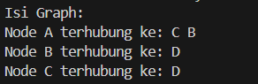
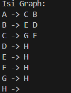
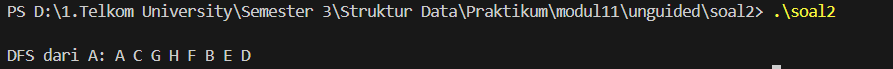
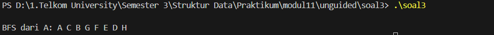

<h1 align = center > <b>  LAPORAN PRATIKUM STUKTUR DATA PERTEMUAN 2 <br>
</b></h1><p align = center><b>Nama : Alvin Aldino Rahmatullah || NIM : 103112430283 || Kelas : IF-12-05</b></p>

<h1> 1. Motivasi Belajar Struktur Data </h1>

Saya merasa mempelajari struktur data adalah pondasi awal untuk mengelola dan memahami informasi. Dengan memahami struktur data dengan baik saya merasa nantinya akan mudah menyusun program yang lebih efisien dan mampu menyelesaikan permasalahan nyata yang dihadapi, seperti pengolahan data pada aplikasi, layanan digital dan program yang mempermudah kegiatan sehari hari


<h1> 2. Dasar Teori </h1>

1. Graph

Graph merupakan struktur data non-linear yang digunakan untuk merepresentasikan hubungan antar elemen dalam bentuk node (simpul) dan edge (sisi). Node merepresentasikan objek atau entitas, sedangkan edge menunjukkan hubungan antar node tersebut. Graph dapat bersifat terarah (directed) atau tidak terarah (undirected), serta dapat direpresentasikan menggunakan adjacency list, yaitu setiap node menyimpan daftar node lain yang terhubung dengannya, sehingga efisien untuk menggambarkan relasi pada graph yang kompleks.

2. Breadth First Search (BFS)

Breadth First Search (BFS) adalah algoritma traversal graph yang menelusuri node secara melebar berdasarkan level. Traversal dimulai dari satu node awal, kemudian seluruh node yang bertetangga langsung dikunjungi terlebih dahulu sebelum berpindah ke node pada tingkat berikutnya. BFS umumnya digunakan untuk mengetahui urutan keterhubungan antar node secara bertahap dan banyak diterapkan pada pencarian jalur terpendek serta analisis struktur graph.

3. Depth First Search (DFS)

Depth First Search (DFS) adalah algoritma traversal graph yang menelusuri node secara mendalam, yaitu mengikuti satu jalur hingga mencapai node paling jauh sebelum kembali untuk menelusuri jalur lain. Proses ini memungkinkan eksplorasi graph secara menyeluruh berdasarkan kedalaman hubungan antar node. DFS sering digunakan untuk menganalisis struktur graph, seperti mendeteksi jalur, siklus, atau keterhubungan antar node dalam graph.


<h1> 3. Guided </h1>

### Guided

**-Code Program-**

**graph.h**

```cpp

#ifndef GRAPH_H
#define GRAPH_H
#include <iostream>
using namespace std;

typedef char infoGraph;
typedef struct ElmNode *adrNode;
typedef struct ElmEdge *adrEdge;

struct ElmNode {
    infoGraph info;
    bool visited;
    adrEdge firstEdge;
    adrNode next;
};

struct ElmEdge {
    adrNode node;
    adrEdge next;
};

struct Graph {
    adrNode first;
};

void createGraph(Graph &G);
adrNode allocateNode(infoGraph X);
void insertNode(Graph &G, infoGraph X);
void connectNode(Graph &G, infoGraph start, infoGraph end);
void printGraph(Graph &G);
#endif

```

**graph_print.cpp**

```cpp

#include "graph.h"

 // Prosedur untuk menampilkan isi graph
void printGraph(Graph &G) {
    adrNode P = G.first;               
    while (P != NULL) { // Loop selama masih ada node
        cout << "Node " << P->info << " terhubung ke: "; 
        adrEdge E = P->firstEdge;     
        while (E != NULL) { // Loop selama masih ada edge
            cout << E->node->info << " "; // Menampilkan node tujuan edge
            E = E->next; // Pindah ke edge berikutnya
        }
        cout << endl; // Pindah baris setelah satu node selesai dicetak
        P = P->next; // Pindah ke node berikutnya
    }
}


```

**Graph.init.cpp**

```cpp

#include "graph.h" 

void createGraph(Graph &G) {     
    G.first = NULL; // Menandakan bahwa graph masih kosong
}

// Fungsi untuk mengalokasikan node baru
adrNode allocateNode(infoGraph X) {
    adrNode P = new ElmNode;// Mengalokasikan memori untuk satu node graph
    P->info = X; // Mengisi informasi node dengan nilai X
    P->visited = false; // Menandai node sebagai belum dikunjungi
    P->firstEdge = NULL; // Menginisialisasi list edge kosong
    P->next = NULL; // Menginisialisasi pointer ke node berikutnya
    return P; // Mengembalikan alamat node yang baru dibuat
}

// Prosedur untuk menambahkan node ke graph
void insertNode(Graph &G, infoGraph X) { 
    adrNode P = allocateNode(X);       
    if (G.first == NULL) {          
        G.first = P; // Jika kosong, node menjadi node pertama
    } else {
        adrNode Q = G.first;           
        while (Q->next != NULL) { // Menelusuri hingga node terakhir
            Q = Q->next; // Pindah ke node berikutnya
        }
        Q->next = P; // Menyambungkan node baru di akhir list
    }
}

```

**graph_edge.cpp**

```cpp

#include "graph.h"                         

// Fungsi untuk mencari node berdasarkan info
adrNode findNode(Graph G, infoGraph X) {  
    adrNode P = G.first;                 
    while (P != NULL) {                   
        if (P->info == X) return P; // Jika info node cocok, kembalikan alamat node
        P = P->next; // Pindah ke node berikutnya
    }
    return NULL; // Mengembalikan NULL jika node tidak ditemukan
}

// Prosedur menghubungkan dua node
void connectNode(Graph &G, infoGraph start, infoGraph end) { 
    adrNode pStart = findNode(G, start); // Mencari node awal
    adrNode pEnd = findNode(G, end); // Mencari node tujuan

    if (pStart != NULL && pEnd != NULL) { // Memastikan kedua node ditemukan
        adrEdge newEdge = new ElmEdge; // Mengalokasikan memori edge baru
        newEdge->node = pEnd; // Menyimpan alamat node tujuan
        newEdge->next = pStart->firstEdge; // Menyisipkan edge di awal list edge
        pStart->firstEdge = newEdge; // Menghubungkan edge ke node awal
    }
}

```

**main.cpp**

```cpp

#include "graph.h" 
#include <iostream>         

using namespace std;        

int main() {               
    Graph G; // Mendeklarasikan variabel Graph
    createGraph(G); // Menginisialisasi graph agar kondisi awal kosong

    // Menambahkan Node A, B, C, D
    insertNode(G, 'A');
    insertNode(G, 'B');     
    insertNode(G, 'C');     
    insertNode(G, 'D');     

    // Menghubungkan Node 
    connectNode(G, 'A', 'B'); 
    connectNode(G, 'A', 'C'); 
    connectNode(G, 'B', 'D'); 
    connectNode(G, 'C', 'D'); 

    cout << "Isi Graph:" << endl; 
    printGraph(G);                // Menampilkan seluruh isi graph beserta relasi node

    return 0;
}

```

**-Penjelasan Umum-**

Program ini memiliki operasi dasar yang tersedia meliputi createGraph untuk menginisialisasi graph kosong, insertNode untuk menambahkan node baru, connectNode untuk membentuk relasi antar node secara terarah, dan printGraph untuk menampilkan seluruh isi graph. Setiap edge disimpan dalam bentuk linked list yang menunjuk ke node tujuan, sehingga satu node dapat memiliki lebih dari satu hubungan. Implementasi ini merepresentasikan directed graph, dan pada output program akan ditampilkan setiap node beserta daftar node yang terhubung langsung dengannya, sehingga struktur dan relasi graph dapat diamati secara jelas.


**-Output-**




<h1>4. Unguided</h1>

**-Code Program Unguided 1-**

**graph.h**

```cpp

#ifndef GRAPH_H                 
#define GRAPH_H

#include <iostream>            
using namespace std;         

typedef char infoGraph;          

typedef struct ElmNode *adrNode;
typedef struct ElmEdge *adrEdge;

struct ElmEdge {                
    adrNode node; // node tujuan
    adrEdge next; // edge berikutnya
};

struct ElmNode {               
    infoGraph info;             
    bool visited;                
    adrEdge firstEdge;         
    adrNode next;                
};

struct Graph {                 
    adrNode first;            
};

void createGraph(Graph &G);      
adrNode allocateNode(infoGraph X); 
void insertNode(Graph &G, infoGraph X); 
void connectNode(Graph &G, infoGraph start, infoGraph end); 
void printGraph(Graph &G);

#endif

```

**graph_print.cpp**

```cpp

#include "graph.h"              

  // menampilkan graph
void printGraph(Graph &G) {    
    adrNode P = G.first; // mulai dari node pertama
    while (P != NULL) {         
        cout << P->info << " -> "; //selama node ada, cetak node
        adrEdge E = P->firstEdge; 
        while (E != NULL) {     
            cout << E->node->info << " "; 
            E = E->next; // pindah ke edge berikutnya
        }
        cout << endl; // pindah baris
        P = P->next; // pindah ke node berikutnya
    }
}

```

**graph_init.cpp**

```cpp

#include "graph.h"               

void createGraph(Graph &G) {     
    G.first = NULL;        
}

// fungsi alokasi node
adrNode allocateNode(infoGraph X) { 
    adrNode P = new ElmNode; // alokasi memori node
    P->info = X;              
    P->visited = false; // node belum dikunjungi
    P->firstEdge = NULL;    
    P->next = NULL; // belum ada node berikutnya
    return P; // mengembalikan node
}

// menambah node ke graph
void insertNode(Graph &G, infoGraph X) { 
    adrNode P = allocateNode(X); // membuat node baru
    if (G.first == NULL) {       
        G.first = P; //jika graph kosong, node akan menjadi node pertama
    } else { // jika graph tidak kosong
        adrNode Q = G.first;    
        while (Q->next != NULL) { // mencari node terakhir
            Q = Q->next;// geser ke node berikutnya
        }
        Q->next = P;         
    }
}


```

**graph_edge.cpp**

```cpp

#include "graph.h"               

adrNode findNode(Graph G, infoGraph X) { 
    adrNode P = G.first; // mencari node, dimulai dari node pertama
    while (P != NULL) {          
        if (P->info == X) {      
            return P;            
        }
        P = P->next;             
    }
    return NULL;                 
}

// menghubungkan node
void connectNode(Graph &G, infoGraph start, infoGraph end) { 
    adrNode pStart = findNode(G, start); // node awal
    adrNode pEnd = findNode(G, end);// node tujuan

    if (pStart != NULL && pEnd != NULL) { // jika kedua node ada
        adrEdge E = new ElmEdge;          
        E->node = pEnd;                  
        E->next = pStart->firstEdge;     
        pStart->firstEdge = E;           
    }
}

```

**main.cpp**

```cpp

#include "graph.h"

int main() {
    Graph G;
    createGraph(G);

    // Menambahkan Node A, B, C, D, E, F, G, H
    insertNode(G, 'A');
    insertNode(G, 'B');
    insertNode(G, 'C');
    insertNode(G, 'D');
    insertNode(G, 'E');
    insertNode(G, 'F');
    insertNode(G, 'G');
    insertNode(G, 'H');

    // Menghubungkan Node
    connectNode(G, 'A', 'B');
    connectNode(G, 'A', 'C');
    connectNode(G, 'B', 'D');
    connectNode(G, 'B', 'E');
    connectNode(G, 'C', 'F');
    connectNode(G, 'C', 'G');
    connectNode(G, 'D', 'H');
    connectNode(G, 'E', 'H');
    connectNode(G, 'F', 'H');
    connectNode(G, 'G', 'H');

    cout << "Isi Graph:" << endl;
    printGraph(G);

    return 0;
}

```

**-Penjelasan Umum-**

Setiap node menyimpan informasi berupa karakter serta daftar edge yang menunjukkan hubungan ke node lain. Struktur graph terdiri dari node yang saling terhubung melalui edge yang disimpan dalam bentuk linked list, sehingga satu node dapat memiliki lebih dari satu relasi. Operasi dasar yang disediakan meliputi createGraph untuk menginisialisasi graph kosong, allocateNode dan insertNode untuk membuat serta menambahkan node ke dalam graph, connectNode untuk membentuk hubungan antar node secara terarah (directed graph), dan printGraph untuk menampilkan seluruh isi graph beserta node-node yang terhubung

**-Output-**




**-Code Program Unguided 2-**

**graph.h**

```cpp

#ifndef GRAPH_H                 
#define GRAPH_H

#include <iostream>            
using namespace std;         

typedef char infoGraph;          

typedef struct ElmNode *adrNode;
typedef struct ElmEdge *adrEdge;

struct ElmEdge {                
    adrNode node; // node tujuan
    adrEdge next; // edge berikutnya
};

struct ElmNode {               
    infoGraph info;             
    bool visited;                
    adrEdge firstEdge;         
    adrNode next;                
};

struct Graph {                 
    adrNode first;            
};

void createGraph(Graph &G);      
adrNode allocateNode(infoGraph X); 
void insertNode(Graph &G, infoGraph X); 
void connectNode(Graph &G, infoGraph start, infoGraph end); 
void printGraph(Graph &G);
// traversal
adrNode findNode(Graph G, infoGraph X); // deklarasi findNode
void resetVisited(Graph &G);        // mengosongkan status visited
void printDFS(Graph &G, adrNode N); // menampilkan DFS

#endif

```

**graph_print.cpp**

```cpp

#include "graph.h"              

  // menampilkan graph
void printGraph(Graph &G) {    
    adrNode P = G.first; // mulai dari node pertama
    while (P != NULL) {         
        cout << P->info << " -> "; //selama node ada, cetak node
        adrEdge E = P->firstEdge; 
        while (E != NULL) {     
            cout << E->node->info << " "; 
            E = E->next; // pindah ke edge berikutnya
        }
        cout << endl; // pindah baris
        P = P->next; // pindah ke node berikutnya
    }
}

```

**graph_init.cpp**

```cpp

#include "graph.h"               

void createGraph(Graph &G) {     
    G.first = NULL;        
}

// fungsi alokasi node
adrNode allocateNode(infoGraph X) { 
    adrNode P = new ElmNode; // alokasi memori node
    P->info = X;              
    P->visited = false; // node belum dikunjungi
    P->firstEdge = NULL;    
    P->next = NULL; // belum ada node berikutnya
    return P; // mengembalikan node
}

// menambah node ke graph
void insertNode(Graph &G, infoGraph X) { 
    adrNode P = allocateNode(X); // membuat node baru
    if (G.first == NULL) {       
        G.first = P; //jika graph kosong, node akan menjadi node pertama
    } else { // jika graph tidak kosong
        adrNode Q = G.first;    
        while (Q->next != NULL) { // mencari node terakhir
            Q = Q->next;// geser ke node berikutnya
        }
        Q->next = P;         
    }
}


```

**graph_edge.cpp**

```cpp

#include "graph.h"               

adrNode findNode(Graph G, infoGraph X) { 
    adrNode P = G.first; // mencari node, dimulai dari node pertama
    while (P != NULL) {          
        if (P->info == X) {      
            return P;            
        }
        P = P->next;             
    }
    return NULL;                 
}

// menghubungkan node
void connectNode(Graph &G, infoGraph start, infoGraph end) { 
    adrNode pStart = findNode(G, start); // node awal
    adrNode pEnd = findNode(G, end);     // node tujuan

    if (pStart != NULL && pEnd != NULL) { // jika kedua node ada
        adrEdge E = new ElmEdge;          
        E->node = pEnd;                  
        E->next = pStart->firstEdge;     
        pStart->firstEdge = E;           
    }
}
// graph_edge //
adrNode findNode(Graph G, infoGraph X);
void connectNode(Graph &G, infoGraph start, infoGraph end);


```

**graph_traversal.cpp**

```cpp

#include "graph.h"                

void resetVisited(Graph &G) {       
    adrNode P = G.first;            
    while (P != NULL) { 
        P->visited = false;// set visited menjadi false
        P = P->next; // pindah ke node berikutnya
    }
}

void printDFS(Graph &G, adrNode N) {
    if (N == NULL) {                
        return; //jika node kosong maka keluar
    }

    if (N->visited == true) {      
        return; // jika sudah dikunjungi maka keluar
    }

    N->visited = true; // tandai node dikunjungi
    cout << N->info << " "; // cetak node

    adrEdge E = N->firstEdge; 
    while (E != NULL) {             
        printDFS(G, E->node); // DFS ke node tujuan
        E = E->next; // pindah ke edge berikutnya
    }
}

```

**main.cpp**

```cpp

#include "graph.h"

int main() {
    Graph G;
    createGraph(G);

    // Menambahkan Node A, B, C, D, E, F, G, H
    insertNode(G, 'A');
    insertNode(G, 'B');
    insertNode(G, 'C');
    insertNode(G, 'D');
    insertNode(G, 'E');
    insertNode(G, 'F');
    insertNode(G, 'G');
    insertNode(G, 'H');

    // Menghubungkan Node
    connectNode(G, 'A', 'B');
    connectNode(G, 'A', 'C');
    connectNode(G, 'B', 'D');
    connectNode(G, 'B', 'E');
    connectNode(G, 'C', 'F');
    connectNode(G, 'C', 'G');
    connectNode(G, 'D', 'H');
    connectNode(G, 'E', 'H');
    connectNode(G, 'F', 'H');
    connectNode(G, 'G', 'H');

    cout << endl << "DFS dari A: ";    
    resetVisited(G);                
    printDFS(G, findNode(G, 'A'));       

    return 0;
}

```

**-Penjelasan Umum-**

Program ini penambahan fitur traversal Depth First Search (DFS). Struktur dasar graph masih sama dengan sebelumnya hanya operasi tambahan yang diimplementasikan meliputi resetVisited untuk mengatur ulang status kunjungan seluruh node dan printDFS untuk menampilkan urutan penelusuran DFS secara rekursif. Proses DFS dimulai dari node tertentu, menandai node sebagai telah dikunjungi, lalu menelusuri node tujuan melalui edge yang tersedia hingga mencapai node terdalam sebelum kembali ke node sebelumnya. Urutan penelusuran DFS pada program ini berjalan dari kanan ke kiri.

**-Output-**




**-Code Program Unguided 3-**

**graph.h**

```cpp

#ifndef GRAPH_H                 
#define GRAPH_H

#include <iostream>            
using namespace std;         

typedef char infoGraph;          

typedef struct ElmNode *adrNode;
typedef struct ElmEdge *adrEdge;

struct ElmEdge {                
    adrNode node; // node tujuan
    adrEdge next; // edge berikutnya
};

struct ElmNode {               
    infoGraph info;             
    bool visited;                
    adrEdge firstEdge;         
    adrNode next;                
};

struct Graph {                 
    adrNode first;            
};

// queue untuk BFS
struct ElmQueue {                   
    adrNode node;                   
    ElmQueue *next;                 
};

void createGraph(Graph &G);      
adrNode allocateNode(infoGraph X); 
void insertNode(Graph &G, infoGraph X); 
void connectNode(Graph &G, infoGraph start, infoGraph end); 
void printGraph(Graph &G);
// traversal
adrNode findNode(Graph G, infoGraph X); 
void resetVisited(Graph &G);        
// BFS
typedef ElmQueue* adrQueue;
void printBFS(Graph &G, adrNode N);

#endif

```

**graph_print.cpp**

```cpp

#include "graph.h"              

  // menampilkan graph
void printGraph(Graph &G) {    
    adrNode P = G.first; // mulai dari node pertama
    while (P != NULL) {         
        cout << P->info << " -> "; //selama node ada, cetak node
        adrEdge E = P->firstEdge; 
        while (E != NULL) {     
            cout << E->node->info << " "; 
            E = E->next; // pindah ke edge berikutnya
        }
        cout << endl; // pindah baris
        P = P->next; // pindah ke node berikutnya
    }
}


```

**graph_init.cpp**

```cpp

#include "graph.h"               

void createGraph(Graph &G) {     
    G.first = NULL;        
}

// fungsi alokasi node
adrNode allocateNode(infoGraph X) { 
    adrNode P = new ElmNode; // alokasi memori node
    P->info = X;              
    P->visited = false; // node belum dikunjungi
    P->firstEdge = NULL;    
    P->next = NULL; // belum ada node berikutnya
    return P; // mengembalikan node
}

// menambah node ke graph
void insertNode(Graph &G, infoGraph X) { 
    adrNode P = allocateNode(X); // membuat node baru
    if (G.first == NULL) {       
        G.first = P; //jika graph kosong, node akan menjadi node pertama
    } else { // jika graph tidak kosong
        adrNode Q = G.first;    
        while (Q->next != NULL) { // mencari node terakhir
            Q = Q->next;         // geser ke node berikutnya
        }
        Q->next = P;         
    }
}

```

**graph_edge.cpp**

```cpp

#include "graph.h"               

adrNode findNode(Graph G, infoGraph X) { 
    adrNode P = G.first;         // mencari node, dimulai dari node pertama
    while (P != NULL) {          
        if (P->info == X) {      
            return P;            
        }
        P = P->next;             
    }
    return NULL;                 
}

// menghubungkan node
void connectNode(Graph &G, infoGraph start, infoGraph end) { 
    adrNode pStart = findNode(G, start); // node awal
    adrNode pEnd = findNode(G, end);     // node tujuan

    if (pStart != NULL && pEnd != NULL) { // jika kedua node ada
        adrEdge E = new ElmEdge;          
        E->node = pEnd;                  
        E->next = pStart->firstEdge;     
        pStart->firstEdge = E;           
    }
}

```

**graph_traversal.cpp**

```cpp

#include "graph.h"        

void resetVisited(Graph &G) {
    adrNode P = G.first;
    while (P != NULL) {
        P->visited = false;
        P = P->next;
    }
}


void enqueue(adrQueue &front, adrQueue &rear, adrNode N) { // menambah queue
    adrQueue Q = new ElmQueue; // alokasi queue baru
    Q->node = N;                   
    Q->next = NULL;// next kosong

    if (front == NULL) {           
        front = Q; // front menunjuk Q
        rear = Q; // rear menunjuk Q
    } else {                         
        rear->next = Q; // sambungkan ke belakang
        rear = Q; // geser rear
    }
}

adrNode dequeue(adrQueue &front, adrQueue &rear) { 
    adrQueue Q = front;             
    adrNode N = Q->node;          

    front = front->next;           
    if (front == NULL) {            
        rear = NULL;     
    }

    delete Q;                
    return N;               
}

void printBFS(Graph &G, adrNode N) { 
    if (N == NULL) {              
        return;                 
    }

    adrQueue front = NULL;         
    adrQueue rear = NULL;       

    N->visited = true;             
    enqueue(front, rear, N);       

    while (front != NULL) {         // selama queue tidak kosong
        adrNode P = dequeue(front, rear); // ambil node
        cout << P->info << " ";      // cetak node

        adrEdge E = P->firstEdge;   // ambil edge
        while (E != NULL) {          // selama edge ada
            if (E->node->visited == false) { // jika belum dikunjungi
                E->node->visited = true;     // tandai visited
                enqueue(front, rear, E->node); // masukkan queue
            }
            E = E->next;             // pindah edge
        }
    }
}

```

**main.cpp**

```cpp

#include "graph.h"

int main() {
    Graph G;
    createGraph(G);

    // Menambahkan Node A, B, C, D, E, F, G, H
    insertNode(G, 'A');
    insertNode(G, 'B');
    insertNode(G, 'C');
    insertNode(G, 'D');
    insertNode(G, 'E');
    insertNode(G, 'F');
    insertNode(G, 'G');
    insertNode(G, 'H');

    // Menghubungkan Node
    connectNode(G, 'A', 'B');
    connectNode(G, 'A', 'C');
    connectNode(G, 'B', 'D');
    connectNode(G, 'B', 'E');
    connectNode(G, 'C', 'F');
    connectNode(G, 'C', 'G');
    connectNode(G, 'D', 'H');
    connectNode(G, 'E', 'H');
    connectNode(G, 'F', 'H');
    connectNode(G, 'G', 'H');

    cout << endl << "BFS dari A: ";      
    resetVisited(G); 
    printBFS(G, findNode(G, 'A'));      
    cout << endl;                        

    return 0;
}

```

**-Penjelasan Umum-**

Program ini memiliki penambahan fitur traversal Breadth First Search (BFS) untuk menelusuri graph secara melebar. Struktur dasar graph tetap sama. Traversal BFS diimplementasikan menggunakan struktur queue untuk mengatur urutan kunjungan node berdasarkan first in first out (FIFO). Proses BFS dimulai dari node tertentu, kemudian menelusuri seluruh node pada level yang sama sebelum berpindah ke level berikutnya. Urutan penelusuran BFS pada program ini berjalan dari kanan ke kiri.

**-Output-**



<h1> 6. Referensi </h1>

1. https://www.w3schools.com/dsa/dsa_theory_graphs.php
2. https://www.programiz.com/dsa/graph-bfs/
3. https://www.geeksforgeeks.org/dsa/depth-first-search-or-dfs-for-a-graph/
