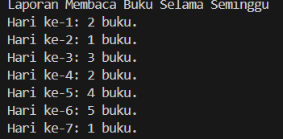
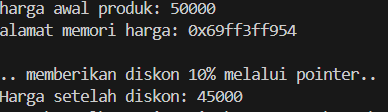
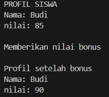
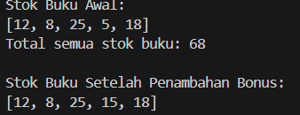

<h1 align = center > <b>  LAPORAN PRATIKUM STUKTUR DATA PERTEMUAN 2 <br>
</b></h1><p align = center><b>Nama : Alvin Aldino Rahmatullah || NIM : 103112430283 || Kelas : IF-12-05</b></p>

<h1> 1. Motivasi Belajar Struktur Data </h1>

Saya merasa mempelajari struktur data adalah pondasi awal untuk mengelola dan memahami informasi. Dengan memahami struktur data dengan baik saya merasa nantinya akan mudah menyusun program yang lebih efisien dan mampu menyelesaikan permasalahan nyata yang dihadapi, seperti pengolahan data pada aplikasi, layanan digital dan program yang mempermudah kegiatan sehari hari

<h1> 2. Dasar Teori </h1>

Array adalah struktur data yang digunakan untuk menyimpan kumpulan nilai atau elemen-elemen dengan tipe data yang sama. Dalam bahasa Indonesia, “array” bisa diartikan sebagai “larik” atau “tabel”. Setiap elemen dalam array memiliki indeks yang memungkinkan kita mengakses nilai atau data tersebut secara individual. Array adalah alat yang berguna dalam pemrograman karena memungkinkan kita untuk mengelola data dalam jumlah besar secara efisien. Kita bisa menggunakan array untuk menyimpan data seperti angka, string, atau bahkan objek yang lebih kompleks.

Pointer merupakan salah satu konsep dasar yang sangat penting dalam bahasa pemrograman C++. Pointer adalah variabel khusus yang digunakan untuk menyimpan alamat memori dari variabel lain. Dengan kata lain, pointer tidak menyimpan nilai data secara langsung, tetapi menyimpan lokasi di mana data tersebut berada di memori komputer.Fungsi dari pointer adalah untuk menghemat memori, pass by reference, pengelolaan memori dinamis dan manipulasi struktur data kompleks.

Fungsi adalah sub-program yang bisa digunakan kembali baik di dalam program itu sendiri, maupun di program yang lain. Fungsi dapat menerima input dan menghasilkan output. Fungsi memang wajib ada di setiap program C++, karena fungsi inilah yang akan dieksekusi pertama kali saat program berjalan. 


<h1> 3. Guided </h1>

### 3.1 Guided 1 (Baca Buku)

**-Code Program-**

```cpp
#include <iostream> // Library untuk input dan output
using namespace std;

int main() {
    int bukuPerHari[7]={2,1,3,2,4,5,1}; // Inisialisasi array dengan jumlah buku yang dibaca setiap hari selama seminggu 
    int totalBuku=0; // Variabel untuk menyimpan total buku yang dibaca selama seminggu

    cout<<"Laporan Membaca Buku Selama Seminggu"<<endl; // output judul laporan
    for (int i=0; i<7; i++) { // Perulangan untuk menampilkan jumlah buku per hari dari hari ke 1 sampai ke 7
        
        cout<<"Hari ke-"<<i+1<<": "<<bukuPerHari[i] <<" buku."<<endl; // Menampilkan jumlah buku yang dibaca pada hari ke i yang ditambah satu persatu da meanmpilkan buku yang dibaca pada hari tersebut   
        totalBuku += bukuPerHari[i]; // Menambahkan jumlah buku hari ini ke total keseluruhan
    }
}
```

**-Penjelasan Umum-**

Ini adalah sebuah program sederhana yang dapat digunakan untuk mencatat aktivitas membaca buku selama satu minggu. Program ini berfungsi menampilkan jumlah buku yang dibaca setiap hari, serta menghitung total keseluruhan buku yang telah dibaca selama seminggu. Data disimpan dalam bentuk array agar lebih mudah diolah dan ditampilkan secara berurutan.

**-Output-**



### 3.2 Guided 2 (Diskon)

**-Code Program-**

```cpp
#include <iostream> // Library standar untuk input dan output
using namespace std; 

int main() {
    float hargaProduk = 50000.0; // Inisialisasi harga awal produk
    float *ptrharga; // Deklarasi pointer untuk menyimpan alamat variabel hargaProduk
    ptrharga = &hargaProduk; // Pointer diarahkan ke alamat memori hargaProduk

    cout << "harga awal produk: " << hargaProduk << endl; // Menampilkan harga sebelum diskon
    cout << "alamat memori harga: " << ptrharga << endl; // Menampilkan alamat memori tempat harga disimpan

    cout << "\n.. memberikan diskon 10% melalui pointer.." << endl; // Informasi proses diskon
    *ptrharga = *ptrharga * 0.9; // Mengakses dan mengubah nilai harga melalui pointer (diskon 10%)
    cout << "Harga setelah diskon: " << hargaProduk << endl; // Menampilkan harga setelah perubahan melalui pointer

    return 0;
}
```

**-Penjelasan Umum-**

program ini adalah program sederhana yang menunjukkan cara penggunaan pointer dalam bahasa C++. Program ini mensimulasikan proses pemberian diskon pada sebuah produk. Nilai harga produk awal disimpan dalam variabel, lalu diakses dan dimodifikasi melalui pointer. Dengan cara ini, perubahan nilai dapat langsung memengaruhi variabel aslinya di memori. 

**-Output-**



### 3.3 Guided 3 ()

**-Code Program-**

```cpp
#include <iostream> // Library untuk input dan output
using namespace std;

// Fungsi untuk menghitung rata-rata nilai tugas dan UTS
float hitungRataRata (int nilaiTugas, int nilaiUTS){
    return (nilaiTugas + nilaiUTS) / 2.0f; // Mengembalikan hasil rata-rata dalam bentuk float
}

// Fungsi untuk mencetak profil siswa nama dan nilai
void cetakProfil(string nama, float nilai){
    cout << "Nama: " << nama << endl; // Menampilkan nama siswa
    cout << "nilai: " << nilai << endl; // Menampilkan nilai siswa
}

// Fungsi untuk menambahkan nilai bonus pakai & 
void beriNilaiBonus(float &nilai){
    nilai += 5.0f; // Menambahkan 5 poin ke nilai asli
}

int main() {
    string namaSiswa = "Budi"; // Variabel untuk menyimpan nama siswa yan bertipe string
    int tugas = 80, uts = 90;  // Nilai tugas dan UTS siswa

    float nilaiAkhir = hitungRataRata(tugas, uts); // Memanggil fungsi untuk menghitung rata-rata

    cout << "PROFIL SISWA" << endl;
    cetakProfil(namaSiswa, nilaiAkhir); // Menampilkan profil siswa

    cout << "\nMemberikan nilai bonus" << endl;
    beriNilaiBonus(nilaiAkhir); // Memberikan bonus nilai

    cout << "\nProfil setelah bonus" << endl;
    cetakProfil(namaSiswa, nilaiAkhir); // Menampilkan profil siswa setelah mendapat bonus nilai

    return 0;
}

```

**-Penjelasan Umum-**

Program berguna untuk menghitung nilai akhir seorang siswa berdasarkan nilai tugas dan nilai UTS, kemudian menampilkan profil siswa beserta hasilnya. Setelah itu, program juga memberikan nilai bonus sebesar 5 poin. Variabel nilaiAkhir diubah langsung melalui alamat memorinya tanpa perlu mengembalikan nilai dari fungsi.

**-Output-**




<h1>4. Unguided</h1>

### 4.1 Unguided 1

**-Code Program-**

```cpp
#include <iostream> // Library untuk input dan output
using namespace std; 

void cetakStok(int arr[], int size) { // Fungsi untuk mencetak isi array stok
    cout << "[";
    for (int i = 0; i < size; i++) { // Perulangan untuk menampilkan setiap elemen array
        if (i > 0) cout << ", "; // Menambahkan koma di antara elemen
        cout << arr[i]; // Mencetak nilai stok
    }
    cout << "]" << endl; 
}

int hitungTotalStok(int arr[], int size) { // Fungsi untuk menghitung total semua stok
    int total = 0; // Variabel untuk menyimpan jumlah total
    for (int i = 0; i < size; i++) { // Menjumlahkan setiap elemen array
        total += arr[i];
    }
    return total; // Mengembalikan nilai total stok
}

int* cariStokSedikit(int arr[], int size) { // Fungsi untuk mencari stok paling sedikit (mengembalikan pointer)
    int* stokTerkecil = &arr[0]; // Menunjuk ke elemen pertama sebagai nilai awal terkecil
    for (int i = 1; i < size; i++) { // Mengecek elemen lainnya
        if (arr[i] < *stokTerkecil) { // Jika ditemukan stok yang lebih kecil
            stokTerkecil = &arr[i]; // Ganti pointer ke elemen tersebut
        }
    }
    return stokTerkecil; // Mengembalikan alamat dari stok terkecil
}

void tambahStokBonus(int* stok) { // Fungsi untuk menambah stok sebesar 10
    *stok += 10; // Mengakses nilai yang ditunjuk oleh pointer dan menambah 10
}

int main() { // Fungsi utama
    int stokBuku[] = {12, 8, 25, 5, 18}; // Array berisi stok masing-masing jenis buku
    int jumlahJenisBuku = 5;

    cout << "Stok Buku Awal:\n"; // Menampilkan teks pembuka
    cetakStok(stokBuku, jumlahJenisBuku); // Memanggil fungsi untuk mencetak stok awal

    int total = hitungTotalStok(stokBuku, jumlahJenisBuku); // Menghitung total stok semua buku
    cout << "Total semua stok buku: " << total << endl; // Menampilkan hasil total

    int* stokTerkecil = cariStokSedikit(stokBuku, jumlahJenisBuku); // Mencari buku dengan stok paling sedikit
    tambahStokBonus(stokTerkecil); // Menambah 10 pada stok yang paling sedikit

    cout << "\nStok Buku Setelah Penambahan Bonus:\n"; // Menampilkan teks pembuka hasil akhir
    cetakStok(stokBuku, jumlahJenisBuku); // Menampilkan stok setelah ditambah bonus

    return 0;
}
```

**-Penjelasan Umum-**

Program ini nenggunaan array dan pointer dengan mensimulasikan proses pengelolaan stok buku di sebuah toko. Setiap elemen dalam array merepresentasikan jumlah stok untuk masing-masing jenis buku. Program menampilkan stok awal, menghitung total keseluruhan stok, mencari buku dengan stok paling sedikit, lalu menambahkannya dengan bonus stok menggunakan pointer. Dengan memanfaatkan pointer, program dapat mengakses dan mengubah nilai elemen array secara langsung di memori tanpa perlu menyalin data.

**-Output-**




<h1> 5. Kesimpulan </h1>

Praktikum menggunaan array, fungsi, dan pointer memiliki peran penting dalam membangun program yang efisien dan terstruktur. Array memungkinkan penyimpanan dan pengelolaan data dalam jumlah banyak secara sistematis, sedangkan fungsi membantu memecah program menjadi bagian-bagian kecil yang mudah dipahami dan digunakan kembali. Pointer digunakan untuk mengakses dan memodifikasi data secara langsung di memori, sehingga program dapat berjalan lebih efisien tanpa perlu menyalin nilai variabel.

<h1> 6. Referensi </h1>

1. https://www.w3schools.com/cpp/default.asp

2. https://dosenit.com/kuliah-it/array

3. https://www.petanikode.com/cpp-fungsi/

4. https://www.codepolitan.com/blog/belajar-pointer-c-dasardasar-fungsi-dan-contoh-kode/
