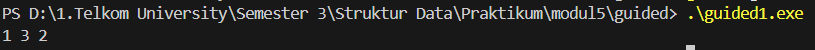
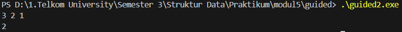
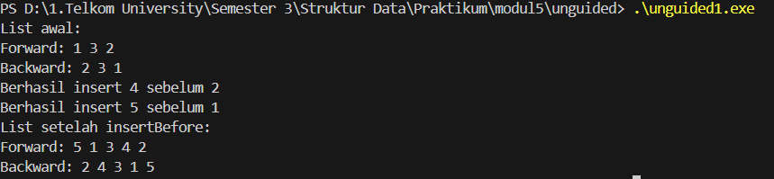
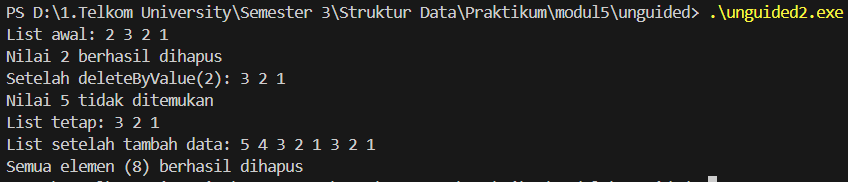
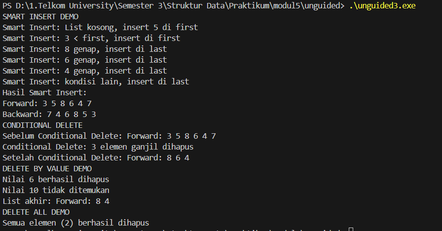

<h1 align = center > <b>  LAPORAN PRATIKUM STUKTUR DATA PERTEMUAN 2 <br>
</b></h1><p align = center><b>Nama : Alvin Aldino Rahmatullah || NIM : 103112430283 || Kelas : IF-12-05</b></p>

<h1> 1. Motivasi Belajar Struktur Data </h1>

Saya merasa mempelajari struktur data adalah pondasi awal untuk mengelola dan memahami informasi. Dengan memahami struktur data dengan baik saya merasa nantinya akan mudah menyusun program yang lebih efisien dan mampu menyelesaikan permasalahan nyata yang dihadapi, seperti pengolahan data pada aplikasi, layanan digital dan program yang mempermudah kegiatan sehari hari

<h1> 2. Dasar Teori </h1>

Double Linked List adalah struktur data yang terdiri dari sekumpulan node, di mana setiap node memiliki tiga bagian: data, pointer ke node berikutnya (next), dan pointer ke node sebelumnya (prev). Struktur ini memungkinkan penelusuran data dalam dua arah, yaitu maju dan mundur, sehingga proses penyisipan dan penghapusan data menjadi lebih efisien dibandingkan singly linked list.

<h1> 3. Guided </h1>

### 3.1 Guided 1

**-Code Program-**

```cpp
#include <iostream>
#define Nil NULL
using namespace std;

typedef int infotype;

typedef struct elmlist *address;

struct elmlist{
    infotype info;
    address next;
    address prev;
};

struct List{
    address first;
    address last;
};

void insertFirst(List &L, address P) {
    P -> next = L.first;
    P -> prev = Nil;
    if (L.first != Nil) L.first -> prev = P;
    else L.last = P;
    L.first = P;
}


void insertLast(List &L, address P) { // definisi fungsi insertLast untuk menyisipkan elemen di akhir list
    P -> prev = L.last;
    P -> next = Nil;
    if (L.last != Nil) L.last -> next = P;
    else L.first = P;
    L.last = P;
}

void insertAfter(List &L, address P, address R) {
    P -> next = R -> next;
    P -> prev = R;
    if (R -> next != Nil) R -> next -> prev = P;
    else L.last = P;
    R -> next = P;
}

address alokasi(infotype x) { // Definisi fungsi alokasi untuk membuat elemen baru
    address P = new elmlist;   // Alokasi memori untuk elemen baru
    P -> info = x;          // Set info elemen dengan nilai x
    P -> next = Nil; // set next elemen ke Nil
    P -> prev = Nil; // set prev elemen ke Nil
    return P;
}

void printInfo(List L) { // Definisi fungsi printInfo untuk mencetak elemen-elemen dalam list
    address P = L.first; // set P ke elemen pertama list
    while (P != Nil) { // 
        cout << P -> info << " ";
        P = P -> next;
    }
    cout << endl;
}

int main() {
    List L;
    L.first = Nil;
    L.last = Nil;

    address P1 = alokasi(1);
    insertFirst(L, P1);

    address P2 = alokasi(2);
    insertLast(L, P2);
    
    address P3 = alokasi(3);
    insertAfter(L, P3, P1);

    printInfo(L); 

    return 0;
}
```

**-Penjelasan Umum-**

Program hubung dua arah melalui pointer nezxt dan prev. Program ini terdiri dari beberapa fungsi utama, seperti insertFirst, insertLast, dan insertAfter, yang digunakan untuk menyisipkan elemen baru di awal, akhir, atau setelah elemen tertentu dalam list. Selain itu, terdapat fungsi alokasi untuk membuat node baru di memori secara dinamis dan printInfo untuk menampilkan isi list dari depan ke belakang. Pada bagian main, program membuat list kosong, kemudian menambahkan elemen secara berurutan: angka 1 dimasukkan di awal list, angka 2 di akhir, dan angka 3 disisipkan setelah angka 1. Hasil akhir yang ditampilkan adalah urutan data 1 3 2, yang menunjukkan bahwa proses penyisipan berhasil dilakukan dengan pointer yang terhubung dua arah secara benar.

**-Output-**



### 3.2 Guided 2 (Diskon)

**-Code Program-**

```cpp
#include <iostream>
#define Nil NULL
using namespace std;

typedef int infotype; // definisi tipe data infotype untuk menyimpan informasi pada elemen list
typedef struct elmlist *address; // definisi tipe data address sebagai pointer ke struct

struct elmlist{
    infotype info; //dekrlarasi variabel info untuk menyimpan data elemen
    address next;
    address prev;
};

struct List{
    address first;
    address last;
};

address alokasi(infotype x) { // Definisi fungsi alokasi untuk membuat elemen baru
    address P = new elmlist;   // Alokasi memori untuk elemen baru
    P -> info = x;          // Set info elemen dengan nilai x
    P -> next = Nil; // set next elemen ke Nil
    P -> prev = Nil; // set prev elemen ke Nil
    return P;
}

void dealokasi(address &P) { // Definisi fungsi dealokasi untuk menghapus elemen dari memori
    delete P; // Menghapus elemen yang ditunjuk oleh pointer P
    P = Nil;   // Set pointer P ke Nil setelah dealokasi
}

void insertFirst(List &L, address P) {
    P -> next = L.first;
    P -> prev = Nil; // set pointer next p ke first saat ini dan prev ke Nil
    if (L.first != Nil) L.first -> prev = P; // jika list tidak kosong, set prev first saat ini ke P
    else L.last = P; // jika list kosong, set last ke P
    L.first = P; // update firstlist menjadi P
}

void printInfo(List L) { // Definisi fungsi printInfo untuk mencetak elemen-elemen dalam list
    address P = L.first; // set P ke elemen pertama list
    while (P != Nil) { // selama P tidak Nil, cetak info dan pindah ke elemen berikutnya
        cout << P -> info << " ";
        P = P -> next;
    }
    cout << endl;
}

void deleteFirst(List &L, address &P) { // Definisi fungsi deleteFirst untuk menghapus elemen pertama dari list
    P = L.first; // set P ke elemen pertama list
    L.first -> next;
    
    if (L.first != Nil) { // jika list tidak kosong
        L.first = L.first -> next; // update first ke elemen berikutnya
        if (L.first != Nil) L.first -> prev = Nil; // jika first baru tidak Nil, set prev ke Nil
        else L.last = Nil; // jika list menjadi kosong, set last ke Nil
        P -> next = Nil; // putuskan hubungan P dengan list
        P -> prev = Nil;
    }
}

void deleteLast(List &L, address &P) { // Definisi fungsi deleteLast untuk menghapus elemen terakhir dari list
    P = L.last; // set P ke elemen terakhir list
    L.last = L.last -> prev;
    if (L.last != Nil) { // jika list tidak kosong
        L.last = L.last -> prev; // update last ke elemen sebelumnya
        if (L.last != Nil) L.last -> next = Nil; // jika last baru tidak Nil, set next ke Nil
        else L.first = Nil; // jika list menjadi kosong, set first ke Nil
        P -> next = Nil; // putuskan hubungan P dengan list
        P -> prev = Nil;
    }
}

void deleteAfter(List &L, address &P, address R) {
    P = R -> next; // set P ke elemen setelah R
    R -> next = P -> next; // hubungkan R ke elemen setelah P
    if (P -> next != Nil) P -> next -> prev = R; // jika P bukan elemen terakhir, hubungkan prev elemen setelah P ke R
    else L.last = R; // jika P adalah elemen terakhir, update last ke R
    P -> next = Nil; // putuskan hubungan P dengan list
    P -> prev = Nil;
}

int main() {
    List L;
    L.first = Nil;
    L.last = Nil;

   insertFirst(L, alokasi(1));
   insertFirst(L, alokasi(2));
   insertFirst(L, alokasi(3));
   printInfo(L); 

    address P;
    deleteFirst(L, P);
    dealokasi(P);
    deleteAfter(L, P, L.first);
    dealokasi(P);
    printInfo(L);
    return 0;
}
```

**-Penjelasan Umum-**

Program ini menggunaka struktur data berantai dua arah di mana setiap elemen memiliki pointer next dan prev. Program juga menggunakan beberapa fungsi utama seperti deleteFirst, deleteLast, dan deleteAfter untuk menghapus node dari posisi yang berbeda dalam list. Sebelum proses penghapusan, elemen-elemen baru dibuat menggunakan fungsi alokasi dan dimasukkan ke dalam list dengan insertFirst. Selain itu, fungsi dealokasi digunakan untuk menghapus node dari memori agar tidak terjadi kebocoran memori. Pada bagian main, tiga elemen pertama (3, 2, 1) dimasukkan ke dalam list, lalu dilakukan penghapusan pada elemen pertama menggunakan deleteFirst dan penghapusan elemen setelah node pertama menggunakan deleteAfter. Hasil akhir dari eksekusi program ini menampilkan sisa elemen dalam list setelah operasi penghapusan berhasil dilakukan.

**-Output-**



<h1>4. Unguided</h1>

### 4.1 Unguided 1

**-Code Program-**

```cpp
#include <iostream>
#define Nil NULL
using namespace std;

typedef int infotype;
typedef struct elmlist *address;

struct elmlist {
    infotype info;
    address next;
    address prev;
};

struct List {
    address first;
    address last;
};

address alokasi(infotype x) {
    address P = new elmlist;
    P->info = x;
    P->next = Nil;
    P->prev = Nil;
    return P;
}

void insertFirst(List &L, address P) {
    P->next = L.first;
    P->prev = Nil;
    if (L.first != Nil) {
        L.first->prev = P;
    } else {
        L.last = P;
    }
    L.first = P;
}

void insertLast(List &L, address P) {
    P->prev = L.last;
    P->next = Nil;
    if (L.last != Nil) {
        L.last->next = P;
    } else {
        L.first = P;
    }
    L.last = P;
}

void insertAfter(List &L, address P, address R) {
    P->next = R->next;
    P->prev = R;
    if (R->next != Nil) {
        R->next->prev = P;
    } else {
        L.last = P;
    }
    R->next = P;
}

void insertBefore(List &L, address P, address R) {
    P->next = R;
    P->prev = R->prev;
    if (R->prev != Nil) {
        R->prev->next = P;
    } else {
        L.first = P; 
    }
    R->prev = P;
}


void printForward(List L) {
    address P = L.first;
    cout << "Forward: ";
    while (P != Nil) {
        cout << P->info << " ";
        P = P->next;
    }
    cout << endl;
}

void printBackward(List L) {
    address P = L.last;
    cout << "Backward: ";
    while (P != Nil) {
        cout << P->info << " ";
        P = P->prev;
    }
    cout << endl;
}

int main() {
    List L;
    L.first = Nil;
    L.last = Nil;

    insertFirst(L, alokasi(2));
    insertFirst(L, alokasi(3));
    insertFirst(L, alokasi(1));

    cout << "List awal:" << endl;
    printForward(L);
    printBackward(L);
    address P1 = alokasi(4);
    insertBefore(L, P1, L.last); 
    cout << "Berhasil insert " << P1->info << " sebelum 2" << endl;

    address P2 = alokasi(5);
    insertBefore(L, P2, L.first); 
    cout << "Berhasil insert " << P2->info << " sebelum 1" << endl;

    cout << "List setelah insertBefore:" << endl;
    printForward(L);
    printBackward(L);

    return 0;
}
```

**-Penjelasan Umum-**

Program ini digunakan untuk mencatat dan menampilkan proses penyisipan elemen yang memiliki fitur berupa Menambahkan elemen di awal, akhir, dan setelah elemen tertentu, lalu Menyisipkan elemen sebelum elemen tertentu (insertBefore) dan menampilkan list dari depan ke belakang (Forward) dan dari belakang ke depan (Backward).

**-Output-**



### 4.2 Unguided 2

**-Code Program-**

```cpp

#include <iostream>
#define Nil NULL
using namespace std;

typedef int infotype;                 
typedef struct elmlist *address;      

struct elmlist {                      
    infotype info;                    
    address next;                     
    address prev;                     
};

struct List {                         
    address first;                    
    address last;                     
};

address alokasi(infotype x) {
    address P = new elmlist;          
    P->info = x;                      
    P->next = Nil;                    
    P->prev = Nil;                    
    return P;                        
}

// Menghapus node dari memori
void dealokasi(address &P) {
    delete P;                        
    P = Nil;                        
}

// Menyisipkan node di awal list
void insertFirst(List &L, address P) {
    P->next = L.first; P->prev = Nil;                    
    if (L.first != Nil) L.first->prev = P;            
    else L.last = P;                   
    L.first = P;                      
}

// Mencetak isi list dari depan ke belakang
void printInfo(List L) {
    address P = L.first;              
    while (P != Nil) {               
        cout << P->info << " ";       
        P = P->next;                  
    }
    cout << endl;                     
}

// Menghapus node pertama
void deleteFirst(List &L, address &P) {
    P = L.first;                    
    if (L.first != Nil) {            
        L.first = L.first->next;    
        if (L.first != Nil) L.first->prev = Nil;   
        else L.last = Nil;            
        P->next = Nil; P->prev = Nil;
    }
}

// Menghapus node terakhir
void deleteLast(List &L, address &P) {
    P = L.last;                      
    if (L.last != Nil) {              
        L.last = L.last->prev;        
        if (L.last != Nil) L.last->next = Nil;       
        else L.first = Nil;            
        P->next = Nil; P->prev = Nil;
    }
}

// Menghapus node setelah node tertentu
void deleteAfter(List &L, address &P, address R) {
    P = R->next;                      
    if (P != Nil) {                
        R->next = P->next;            
        if (P->next != Nil) P->next->prev = R;       
        else L.last = R;            
        P->next = Nil;P->prev = Nil;
    }
}

// Menghapus elemen pertama dengan nilai tertentu
void deleteByValue(List &L, infotype x) {
    address P = L.first;              

    // telusuri list hingga ketemu nilai x
    while (P != Nil && P->info != x) {
        P = P->next;
    }

    // jika tidak ketemu
    if (P == Nil) {
        cout << "Nilai " << x << " tidak ditemukan" << endl;
    } else {
        // jika ketemu, hapus berdasarkan posisinya
        if (P == L.first) {
            address Q; deleteFirst(L, Q); dealokasi(Q);
        } else if (P == L.last) {
            address Q; deleteLast(L, Q); dealokasi(Q);
        } else {
            address Q; deleteAfter(L, Q, P->prev); dealokasi(Q);
        }
        cout << "Nilai " << x << " berhasil dihapus" << endl;
    }
}

// Menghapus semua elemen list
void deleteAll(List &L) {
    address P;
    int count = 0; 
    while (L.first != Nil) {     
        deleteFirst(L, P); dealokasi(P);               
        count++;                      
    }
    cout << "Semua elemen (" << count << ") berhasil dihapus" << endl;
}

int main() {
    List L; L.first = Nil; L.last = Nil; address P;

    insertFirst(L, alokasi(1)); insertFirst(L, alokasi(2)); insertFirst(L, alokasi(3)); insertFirst(L, alokasi(2));

    cout << "List awal: ";
    printInfo(L);                     

    deleteByValue(L, 2);
    cout << "Setelah deleteByValue(2): ";
    printInfo(L);

    deleteByValue(L, 5);
    cout << "List tetap: ";
    printInfo(L);

    insertFirst(L, alokasi(1)); insertFirst(L, alokasi(2)); insertFirst(L, alokasi(3)); insertFirst(L, alokasi(4)); insertFirst(L, alokasi(5));

    cout << "List setelah tambah data: ";
    printInfo(L);
    deleteAll(L);
    return 0;
}

```

**-Penjelasan Umum-**

Program di atas merupakan implementasi penghapusan elemen pada Double Linked List (DLL). Setiap node memiliki dua pointer, next dan prev, sehingga data dapat ditelusuri dua arah. Program ini menggunakan beberapa fungsi penghapusan, seperti deleteFirst, deleteLast, deleteAfter, deleteByValue, dan deleteAll. Fungsi deleteByValue digunakan untuk menghapus elemen dengan nilai tertentu, sedangkan deleteAll untuk menghapus seluruh elemen list. Melalui program ini, proses penghapusan node dan pembaruan pointer dilakukan secara dinamis agar struktur list tetap konsisten.

**-Output-**




### 4.3 Unguided 3

**-Code Program-**

```cpp

#include <iostream>
#define Nil NULL
using namespace std;

typedef int infotype;
typedef struct elmlist *address;

struct elmlist {
    infotype info;
    address next;
    address prev;
};

struct List {
    address first;
    address last;
};

// Membuat elemen baru
address alokasi(infotype x) {
    address P = new elmlist; 
    P->info = x;           
    P->next = Nil;     
    P->prev = Nil;    
    return P;    
}

// Menghapus node dari memori
void dealokasi(address &P) {
    delete P;               
    P = Nil;            
}

// Menyisipkan di awal list
void insertFirst(List &L, address P) {
    P->next = L.first;     
    P->prev = Nil;     
    if (L.first != Nil)
        L.first->prev = P;
    else
        L.last = P;        
    L.first = P; 
}

// Menyisipkan di akhir list
void insertLast(List &L, address P) {
    P->prev = L.last;
    P->next = Nil;
    if (L.last != Nil)
        L.last->next = P;
    else
        L.first = P;
    L.last = P;
}

// Menyisipkan setelah elemen tertentu
void insertAfter(List &L, address P, address R) {
    P->next = R->next;
    P->prev = R;
    if (R->next != Nil)
        R->next->prev = P;
    else
        L.last = P;
    R->next = P;
}

// Menyisipkan sebelum elemen tertentu
void insertBefore(List &L, address P, address R) {
    P->next = R;
    P->prev = R->prev;
    if (R->prev != Nil)
        R->prev->next = P;
    else
        L.first = P;
    R->prev = P;
}

// Cetak list dari depan
void printForward(List L) {
    address P = L.first;
    cout << "Forward: ";
    while (P != Nil) {
        cout << P->info << " ";
        P = P->next;
    }
    cout << endl;
}

// Cetak list dari belakang
void printBackward(List L) {
    address P = L.last;
    cout << "Backward: ";
    while (P != Nil) {
        cout << P->info << " ";
        P = P->prev;
    }
    cout << endl;
}

void deleteFirst(List &L, address &P) {
    P = L.first;
    if (L.first != Nil) {
        L.first = L.first->next;
        if (L.first != Nil)
            L.first->prev = Nil;
        else
            L.last = Nil;
        P->next = Nil;
        P->prev = Nil;
    }
}

void deleteLast(List &L, address &P) {
    P = L.last;
    if (L.last != Nil) {
        L.last = L.last->prev;
        if (L.last != Nil)
            L.last->next = Nil;
        else
            L.first = Nil;
        P->next = Nil;
        P->prev = Nil;
    }
}

void deleteAfter(List &L, address &P, address R) {
    P = R->next;
    if (P != Nil) {
        R->next = P->next;
        if (P->next != Nil)
            P->next->prev = R;
        else
            L.last = R;
        P->next = Nil;
        P->prev = Nil;
    }
}

// Hapus elemen pertama bernilai x
void deleteByValue(List &L, infotype x) {
    address P = L.first;
    while (P != Nil && P->info != x) {
        P = P->next;
    }
    if (P == Nil) {
        cout << "Nilai " << x << " tidak ditemukan" << endl;
    } else {
        if (P == L.first) {
            address Q;
            deleteFirst(L, Q);
            dealokasi(Q);
        } else if (P == L.last) {
            address Q;
            deleteLast(L, Q);
            dealokasi(Q);
        } else {
            address Q;
            deleteAfter(L, Q, P->prev);
            dealokasi(Q);
        }
        cout << "Nilai " << x << " berhasil dihapus" << endl;
    }
}

// Menghapus semua elemen
void deleteAll(List &L) {
    address P;
    int count = 0;
    while (L.first != Nil) {
        deleteFirst(L, P);
        dealokasi(P);
        count++;
    }
    cout << "Semua elemen (" << count << ") berhasil dihapus" << endl;
}

// Smart insert: menyisipkan dengan logika kondisi
void smartInsert(List &L, infotype x) {
    address P = alokasi(x);

    if (L.first == Nil) {
        cout << "Smart Insert: List kosong, insert " << x << " di first" << endl;
        insertFirst(L, P);
    }
    else if (x < L.first->info) {
        cout << "Smart Insert: " << x << " < first, insert di first" << endl;
        insertFirst(L, P);
    }
    else if (x % 2 == 0) {
        cout << "Smart Insert: " << x << " genap, insert di last" << endl;
        insertLast(L, P);
    }
    else if (x > L.first->info && x < L.last->info) {
        cout << "Smart Insert: " << x << " di antara " << L.first->info << " dan " << L.last->info << endl;
        insertAfter(L, P, L.first);
    }
    else {
        cout << "Smart Insert: kondisi lain, insert di last" << endl;
        insertLast(L, P);
    }
}

// Conditional delete: hapus elemen ganjil
void conditionalDelete(List &L) {
    cout << "Sebelum Conditional Delete: ";
    printForward(L);

    address P = L.first;
    int count = 0;
    while (P != Nil) {
        address nextNode = P->next;
        if (P->info % 2 != 0) {
            if (P == L.first) {
                address Q;
                deleteFirst(L, Q);
                dealokasi(Q);
            } else if (P == L.last) {
                address Q;
                deleteLast(L, Q);
                dealokasi(Q);
            } else {
                address Q;
                deleteAfter(L, Q, P->prev);
                dealokasi(Q);
            }
            count++;
        }
        P = nextNode;
    }
    cout << "Conditional Delete: " << count << " elemen ganjil dihapus" << endl;
    cout << "Setelah Conditional Delete: ";
    printForward(L);
}

int main() {
    List L;
    L.first = Nil;
    L.last = Nil;

    cout << "SMART INSERT DEMO" << endl;
    smartInsert(L, 5); smartInsert(L, 3); smartInsert(L, 8); smartInsert(L, 6); smartInsert(L, 4); smartInsert(L, 7);

    cout << "Hasil Smart Insert:" << endl;
    printForward(L);
    printBackward(L);

    cout << "CONDITIONAL DELETE" << endl;
    conditionalDelete(L);

    cout << "DELETE BY VALUE DEMO" << endl;
    deleteByValue(L, 6); deleteByValue(L, 10);
    cout << "List akhir: ";
    printForward(L);

    cout << "DELETE ALL DEMO" << endl;
    deleteAll(L);

    return 0;
}

```

**-Penjelasan Umum-**

Program ini merupakan geabungan dari program sebelumnya yang mendukung operasi penyisipan, penghapusan, dan pencarian data. Selain fungsi dasar seperti insertFirst, insertLast, dan deleteFirst, program ini memiliki fitur tambahan seperti smartInsert untuk menambah data berdasarkan kondisi tertentu dan conditionalDelete untuk menghapus elemen ganjil. Program juga dapat mencetak list dari depan dan belakang, serta menghapus elemen tertentu atau seluruh list.

**-Output-**




<h1> 5. Kesimpulan </h1>

saya dapat memahami bagaimana struktur data berpointer dua arah bekerja untuk mengelola data secara dinamis, efisien, dan fleksibel. Dengan menggunakan dua pointer, yaitu next dan prev, setiap elemen dapat diakses baik dari arah depan maupun belakang, sehingga proses penyisipan, penghapusan, dan penelusuran data menjadi lebih mudah.  

<h1> 6. Referensi </h1>

1. https://www.geeksforgeeks.org/dsa/doubly-linked-list

2. https://www.tutorialspoint.com/data_structures_algorithms/doubly_linked_list_algorithm.htm

3. https://www.programiz.com/dsa/doubly-linked-list

