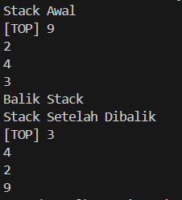
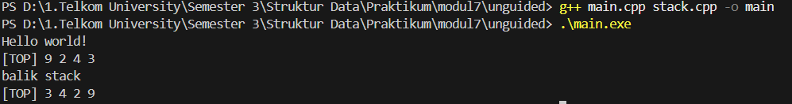
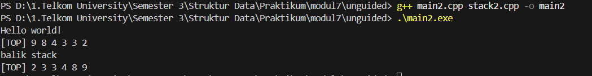
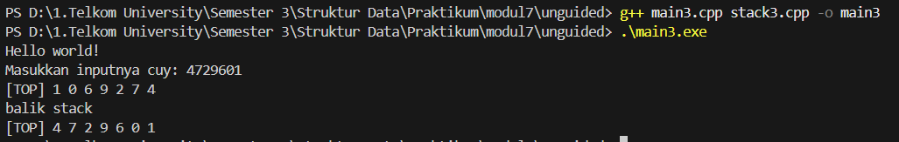

<h1 align = center > <b>  LAPORAN PRATIKUM STUKTUR DATA PERTEMUAN 2 <br>
</b></h1><p align = center><b>Nama : Alvin Aldino Rahmatullah || NIM : 103112430283 || Kelas : IF-12-05</b></p>

<h1> 1. Motivasi Belajar Struktur Data </h1>

Saya merasa mempelajari struktur data adalah pondasi awal untuk mengelola dan memahami informasi. Dengan memahami struktur data dengan baik saya merasa nantinya akan mudah menyusun program yang lebih efisien dan mampu menyelesaikan permasalahan nyata yang dihadapi, seperti pengolahan data pada aplikasi, layanan digital dan program yang mempermudah kegiatan sehari hari

<h1> 2. Dasar Teori </h1>

1. Konsep Stack (Tumpukan)

Stack merupakan struktur data linear yang mengikuti prinsip LIFO (Last-In-First-Out) dimana elemen yang terakhir dimasukkan akan menjadi elemen pertama yang dikeluarkan. Stack memiliki dua operasi fundamental yaitu push untuk menambahkan elemen dan pop untuk menghapus elemen. Dalam implementasinya, stack dapat direpresentasikan menggunakan array atau linked list.

2. Implementasi Stack dengan Array

Implementasi stack menggunakan array melibatkan deklarasi array dengan ukuran tetap dan variabel TOP yang menunjuk ke elemen teratas stack. Keuntungan implementasi array adalah akses yang cepat dan sederhana, namun memiliki keterbatasan pada kapasitas yang fixed.

3. Operasi Dasar Stack

CreateStack: Inisialisasi stack kosong
isEmpty: Memeriksa apakah stack kosong
isFull: Memeriksa apakah stack penuh
push: Menambahkan elemen ke stack
pop: Menghapus elemen dari stack

4. Algoritma Pembalikan Stack

Algoritma pembalikan stack menggunakan pendekatan multiple temporary stack untuk membalik urutan elemen. Teknik ini memanfaatkan sifat LIFO dengan memindahkan elemen melalui stack sementara.

<h1> 3. Guided </h1>

### Guided

**-Code Program-**

**stack.h**

```cpp
#ifndef STACK_H
#define STACK_H

#include <iostream>
#define MaxEl 20
#define Nil -1

typedef int infotype;

struct Stack 
{
    infotype  info[MaxEl]; // Array penyimpan elemen stack
    int TOP; // Indeks elemen teratas stack
};

void CreateStack(Stack &S);
bool isEmpty(Stack S);
bool isFull(Stack S);
void push(Stack &S, int X); // Menambahkan elemen x ke stack s
infotype pop(Stack &S); // Menghapus elemen teratas dari stack s dan mengembalikan nilainya
void printInfo(Stack S); // Mencetak isi stack s
void balikStack(Stack &S); // Membalik urutan elemen dalam stack s
#endif 
```

**stack.cpp**

```cpp
#include "stack.h" // mengimport file header stack.h yang berisi definisi struktur dan konstanta stack
using namespace std;

void CreateStack(Stack &S) {
    S.TOP = Nil; // Inisialisasi TOP dengan Nil untuk menandakan stack kosong
}
//fungsi untuk memeriksa apakah stack kosong
bool IsEmpty(Stack S) 
{
    return S.TOP == Nil; // Mengembalikan true jika TOP adalah Nil (stack kosong)
}

//fungsi untuk memeriksa apakah stack penuh
bool IsFull(Stack S) 
{
    return S.TOP == MaxEl - 1; // Mengembalikan true jika TOP mencapai kapasitas maksimum stack
}

// fungsi untuk menambahkan elemen ke stack (push)
void push(Stack &S, int X) {
    if (!IsFull(S)) { // Memeriksa apakah stack tidak penuh sebelum menambahkan elemen
        S.TOP++; // Menaikkan indeks TOP
        S.info[S.TOP] = X; // Menambahkan elemen X ke posisi TOP
    } else {
        cout << "Stack penuh, tidak dapat menambahkan elemen." << endl; // Pesan jika stack penuh
    }
}

// fungsi untuk menghapus elemen dari stack (pop)
infotype pop(Stack &S) {
    infotype X = -999; // Inisialisasi variabel untuk menyimpan elemen yang dihapus
    if (!IsEmpty(S)) {
        X = S.info[S.TOP]; // Mengambil elemen dari posisi TOP
        S.TOP--; // Menurunkan indeks TOP
    } else {
        cout << "Stack kosong, tidak dapat menghapus elemen." << endl; // Pesan jika stack kosong
    }
    return X; // Mengembalikan elemen yang dihapus
}

void printInfo(Stack S) 
{
    if (IsEmpty(S)) {
        cout << "Stack kosong." << endl; // Pesan jika stack kosong
    } else {
        cout<<"[TOP] " ;// tampilkan penanda posisi TOP
        for (int i = S.TOP; i >= 0; i--) {
            cout << S.info[i] << endl; // Mencetak elemen stack dari TOP ke bawah
        }
    }
}

void balikStack(Stack &S) 
{
   if (!IsEmpty(S)) {
        Stack temp1, temp2;
        CreateStack(temp1); CreateStack(temp2);

        while (!IsEmpty(S)) {
            push (temp1, pop(S)); // Memindahkan elemen dari S ke temp1
        }
        while (!IsEmpty(temp1)) {
            push (temp2, pop(temp1)); // Memindahkan elemen dari temp1 ke temp2
        }
        while (!IsEmpty(temp2)) {
            push (S, pop(temp2)); // Memindahkan elemen dari temp2 kembali ke S
        }
    }
}
```

**main.cpp**

```cpp
#include "stack.h"
#include <iostream>

using namespace std;

int main() {
    Stack S; //derklarasi variabel S bertipe Stack
    CreateStack(S); //inisialisasi stack S menjadi  stack kosong

    push(S, 3); // menambahkan elemen 3 ke stack S
    push(S, 4); // menambahkan elemen 4 ke stack S
    push(S, 8); // menambahkan elemen 8 ke stack S
    pop(S); // menghapus elemen teratas dari stack S (elemen 8)
    push(S, 2); // menambahkan elemen 2 ke stack S
    push(S, 3); // menambahkan elemen 3 ke stack S
    pop(S); // menghapus elemen teratas dari stack S (elemen 3)
    push(S, 9); // menambahkan elemen 9 ke stack S

    cout << "Stack Awal" << endl;
    printInfo(S);

    cout << "Balik Stack" << endl;
    balikStack(S); // membalik urutan elemen dalam stack S

    cout << "Stack Setelah Dibalik" << endl;
    printInfo(S);
    return 0;
}
```

**-Penjelasan Umum-**

Program ini mengimplementasikan struktur data Stack menggunakan array dengan kapasitas maksimal 20 elemen. Stack memiliki operasi dasar seperti CreateStack untuk inisialisasi stack kosong, push untuk menambahkan elemen ke atas stack, pop untuk menghapus dan mengembalikan elemen teratas, serta fungsi tambahan seperti printInfo untuk menampilkan isi stack dari TOP ke bawah dan balikStack yang membalik urutan elemen menggunakan dua stack sementara

**-Output-**




<h1>4. Unguided</h1>

### Unguided 1

**-Code Program-**

**stack.h**

```cpp
#ifndef STACK_H
#define STACK_H

#include <iostream>
#define MaxEl 20
#define Nil -1

typedef int infotype;

struct Stack 
{
    infotype info[MaxEl]; // Array penyimpan elemen stack
    int TOP; // Indeks elemen teratas stack
};

// DEKLARASI FUNGSI
void CreateStack(Stack &S);
bool isEmpty(Stack S);        // DITAMBAHKAN: deklarasi isEmpty
bool isFull(Stack S);         // DITAMBAHKAN: deklarasi isFull
void push(Stack &S, infotype X); // Menambahkan elemen x ke stack s
infotype pop(Stack &S); // Menghapus elemen teratas dari stack s dan mengembalikan nilainya
void printInfo(Stack S); // Mencetak isi stack s
void balikStack(Stack &S); // Membalik urutan elemen dalam stack s

#endif
```

**stack.cpp**

```cpp
#include "stack.h"
using namespace std;

// procedure CreateStack( input/output S : Stack )
void CreateStack(Stack &S) {
    S.TOP = Nil; // Inisialisasi TOP dengan Nil untuk menandakan stack kosong
}

// function untuk memeriksa apakah stack kosong
bool isEmpty(Stack S) {
    return S.TOP == Nil; // Mengembalikan true jika TOP adalah Nil (stack kosong)
}

// function untuk memeriksa apakah stack penuh  
bool isFull(Stack S) {
    return S.TOP == MaxEl - 1; // Mengembalikan true jika TOP mencapai kapasitas maksimum stack
}

// procedure push(input/output S : Stack, input x : infotype)
void push(Stack &S, infotype X) {
    if (!isFull(S)) { // Memeriksa apakah stack tidak penuh sebelum menambahkan elemen
        S.TOP++; // Menaikkan indeks TOP
        S.info[S.TOP] = X; // Menambahkan elemen X ke posisi TOP
    } else {
        cout << "Stack penuh, tidak dapat menambahkan elemen." << endl;
    }
}

// function pop(input/output S : Stack ) -> infotype
infotype pop(Stack &S) {
    infotype X = -999; // Inisialisasi variabel untuk menyimpan elemen yang dihapus
    if (!isEmpty(S)) {
        X = S.info[S.TOP]; // Mengambil elemen dari posisi TOP
        S.TOP--; // Menurunkan indeks TOP
    } else {
        cout << "Stack kosong, tidak dapat menghapus elemen." << endl;
    }
    return X; // Mengembalikan elemen yang dihapus
}

// procedure printInfo( input S : Stack )
void printInfo(Stack S) {
    if (isEmpty(S)) {
        cout << "Stack kosong." << endl;
    } else {
        cout << "[TOP] "; // tampilkan penanda posisi TOP
        for (int i = S.TOP; i >= 0; i--) {
            cout << S.info[i];
            if (i > 0) cout << " "; // tambahkan spasi antara elemen
        }
        cout << endl; // pindah baris setelah mencetak semua elemen
    }
}

// procedure balikStack(input/output S : Stack )
void balikStack(Stack &S) {
    if (!isEmpty(S)) {
        Stack temp1, temp2;
        CreateStack(temp1); 
        CreateStack(temp2);

        while (!isEmpty(S)) {
            push(temp1, pop(S)); // Memindahkan elemen dari S ke temp1
        }
        while (!isEmpty(temp1)) {
            push(temp2, pop(temp1)); // Memindahkan elemen dari temp1 ke temp2
        }
        while (!isEmpty(temp2)) {
            push(S, pop(temp2)); // Memindahkan elemen dari temp2 kembali ke S
        }
    }
}
```

**main.cpp**

```cpp
#include "stack.h"
#include <iostream>

using namespace std;

int main() {
    cout << "Hello world!" << endl;
    
    Stack S; // deklarasi variabel S bertipe Stack
    CreateStack(S); // inisialisasi stack S menjadi stack kosong

    push(S, 3); // menambahkan elemen 3 ke stack S
    push(S, 4); // menambahkan elemen 4 ke stack S  
    push(S, 8); // menambahkan elemen 8 ke stack S
    pop(S);     // menghapus elemen teratas dari stack S (elemen 8)
    push(S, 2); // menambahkan elemen 2 ke stack S
    push(S, 3); // menambahkan elemen 3 ke stack S
    pop(S);     // menghapus elemen teratas dari stack S (elemen 3)
    push(S, 9); // menambahkan elemen 9 ke stack S
    
    printInfo(S); // mencetak isi stack
    
    cout << "balik stack" << endl;
    balikStack(S); // membalik urutan elemen dalam stack S
    
    printInfo(S); // mencetak isi stack setelah dibalik
    
    return 0;
}
```

**-Penjelasan Umum-**

Program ini mengimplementasikan ADT Stack menggunakan array dengan kapasitas maksimal 20 elemen. Stack memiliki operasi dasar seperti CreateStack untuk inisialisasi, push untuk menambah elemen, pop untuk menghapus elemen teratas, serta fungsi tambahan seperti printInfo untuk menampilkan isi stack dari TOP ke dasar dan balikStack yang membalik urutan elemen menggunakan dua stack sementara. Pada main program, dilakukan serangkaian operasi push dan pop yang menghasilkan stack berisi [9, 2, 4, 3] yang kemudian dibalik menjadi [3, 4, 2, 9], operasi stack yang bekerja sesuai prinsip LIFO (Last-In-First-Out)

**-Output-**




### Unguided 2

**-Code Program-**


**stack.h**

```cpp
#ifndef STACK_H
#define STACK_H

#include <iostream>
#define MaxEl 20
#define Nil -1

typedef int infotype;

struct Stack 
{
    infotype info[MaxEl]; // Array penyimpan elemen stack
    int TOP; // Indeks elemen teratas stack
};

// DEKLARASI FUNGSI
void CreateStack(Stack &S);
bool isEmpty(Stack S);        // DITAMBAHKAN: deklarasi isEmpty
bool isFull(Stack S);         // DITAMBAHKAN: deklarasi isFull
void push(Stack &S, infotype X); // Menambahkan elemen x ke stack s
infotype pop(Stack &S); // Menghapus elemen teratas dari stack s dan mengembalikan nilainya
void printInfo(Stack S); // Mencetak isi stack s
void balikStack(Stack &S); // Membalik urutan elemen dalam stack s
void pushAscending(Stack &S, infotype X);  // DITAMBAHKAN: push dengan urutan ascending
#endif
```

**stack.cpp**

```cpp
#include "stack2.h"
using namespace std;

// procedure CreateStack( input/output S : Stack )
void CreateStack(Stack &S) {
    S.TOP = Nil; // Inisialisasi TOP dengan Nil untuk menandakan stack kosong
}

// function untuk memeriksa apakah stack kosong
bool isEmpty(Stack S) {
    return S.TOP == Nil; // Mengembalikan true jika TOP adalah Nil (stack kosong)
}

// function untuk memeriksa apakah stack penuh  
bool isFull(Stack S) {
    return S.TOP == MaxEl - 1; // Mengembalikan true jika TOP mencapai kapasitas maksimum stack
}

// procedure push(input/output S : Stack, input x : infotype)
void push(Stack &S, infotype X) {
    if (!isFull(S)) { // Memeriksa apakah stack tidak penuh sebelum menambahkan elemen
        S.TOP++; // Menaikkan indeks TOP
        S.info[S.TOP] = X; // Menambahkan elemen X ke posisi TOP
    } else {
        cout << "Stack penuh, tidak dapat menambahkan elemen." << endl;
    }
}

// function pop(input/output S : Stack ) -> infotype
infotype pop(Stack &S) {
    infotype X = -999; // Inisialisasi variabel untuk menyimpan elemen yang dihapus
    if (!isEmpty(S)) {
        X = S.info[S.TOP]; // Mengambil elemen dari posisi TOP
        S.TOP--; // Menurunkan indeks TOP
    } else {
        cout << "Stack kosong, tidak dapat menghapus elemen." << endl;
    }
    return X; // Mengembalikan elemen yang dihapus
}

// procedure printInfo( input S : Stack )
void printInfo(Stack S) {
    if (isEmpty(S)) {
        cout << "Stack kosong." << endl;
    } else {
        cout << "[TOP] "; // tampilkan penanda posisi TOP
        for (int i = S.TOP; i >= 0; i--) {
            cout << S.info[i];
            if (i > 0) cout << " "; // tambahkan spasi antara elemen
        }
        cout << endl; // pindah baris setelah mencetak semua elemen
    }
}

// procedure balikStack(input/output S : Stack )
void balikStack(Stack &S) {
    if (!isEmpty(S)) {
        Stack temp1, temp2;
        CreateStack(temp1); 
        CreateStack(temp2);

        while (!isEmpty(S)) {
            push(temp1, pop(S)); // Memindahkan elemen dari S ke temp1
        }
        while (!isEmpty(temp1)) {
            push(temp2, pop(temp1)); // Memindahkan elemen dari temp1 ke temp2
        }
        while (!isEmpty(temp2)) {
            push(S, pop(temp2)); // Memindahkan elemen dari temp2 kembali ke S
        }
    }
}

// procedure pushAscending(in/out S : Stack, in x : integer)
void pushAscending(Stack &S, infotype X) {
    if (isFull(S)) {
        cout << "Stack penuh, tidak dapat menambahkan elemen." << endl;
        return;
    }
    
    // Jika stack kosong atau elemen lebih besar dari TOP, push langsung
    if (isEmpty(S) || X >= S.info[S.TOP]) {
        push(S, X);
        return;
    }
    
    // Jika elemen lebih kecil, cari posisi yang tepat dengan temporary stack
    Stack temp;
    CreateStack(temp);
    
    // Pindahkan elemen dari stack utama ke temp sampai menemukan posisi yang tepat
    while (!isEmpty(S) && X < S.info[S.TOP]) {
        push(temp, pop(S));
    }
    
    // Push elemen baru
    push(S, X);
    
    // Kembalikan elemen dari temp ke stack utama
    while (!isEmpty(temp)) {
        push(S, pop(temp));
    }
}
```

**main.cpp**

```cpp
#include "stack2.h"
#include <iostream>

using namespace std;

int main() {
    cout << "Hello world!" << endl;
    Stack S;
    CreateStack(S);
    pushAscending(S, 3);
    pushAscending(S, 4);
    pushAscending(S, 8);
    pushAscending(S, 2);
    pushAscending(S, 3);
    pushAscending(S, 9);
    printInfo(S);
    cout << "balik stack" << endl;
    balikStack(S);
    printInfo(S);
    return 0;
}
```

**-Penjelasan Umum-**

Fungsi pushAscending ditambahkan untuk menyisipkan elemen baru ke dalam stack dengan menjaga urutan descending (dari besar ke kecil) dimana elemen terbesar selalu di TOP. Algoritma ini menggunakan stack temporary untuk memindahkan sementara elemen-elemen yang lebih kecil dari nilai yang akan dimasukkan, kemudian menyisipkan elemen baru pada posisi yang tepat, dan mengembalikan elemen-elemen temporary tersebut. Hasilnya stack selalu terurut dimana operasi pushAscending(3,4,8,2,3,9) menghasilkan (9,8,4,3,3,2) yang ketika dibalik menjadi (2,3,3,4,8,9) menunjukkan urutan ascending.

**-Output-**




### Unguided 3

**-Code Program-**

**stack.h**

```cpp
#ifndef STACK_H
#define STACK_H

#include <iostream>
#define MaxEl 20
#define Nil -1

typedef int infotype;

struct Stack 
{
    infotype info[MaxEl]; // Array penyimpan elemen stack
    int TOP; // Indeks elemen teratas stack
};

// DEKLARASI FUNGSI
void CreateStack(Stack &S);
bool isEmpty(Stack S);        // DITAMBAHKAN: deklarasi isEmpty
bool isFull(Stack S);         // DITAMBAHKAN: deklarasi isFull
void push(Stack &S, infotype X); // Menambahkan elemen x ke stack s
infotype pop(Stack &S); // Menghapus elemen teratas dari stack s dan mengembalikan nilainya
void printInfo(Stack S); // Mencetak isi stack s
void balikStack(Stack &S); // Membalik urutan elemen dalam stack s
void pushAscending(Stack &S, infotype X);  // DITAMBAHKAN: push dengan urutan ascending
void getInputStream(Stack &S);  // DITAMBAHKAN: membaca input stream dari user
#endif
```

**stack.cpp**

```cpp
#include "stack3.h"
using namespace std;

// procedure CreateStack( input/output S : Stack )
void CreateStack(Stack &S) {
    S.TOP = Nil; // Inisialisasi TOP dengan Nil untuk menandakan stack kosong
}

// function untuk memeriksa apakah stack kosong
bool isEmpty(Stack S) {
    return S.TOP == Nil; // Mengembalikan true jika TOP adalah Nil (stack kosong)
}

// function untuk memeriksa apakah stack penuh  
bool isFull(Stack S) {
    return S.TOP == MaxEl - 1; // Mengembalikan true jika TOP mencapai kapasitas maksimum stack
}

// procedure push(input/output S : Stack, input x : infotype)
void push(Stack &S, infotype X) {
    if (!isFull(S)) { // Memeriksa apakah stack tidak penuh sebelum menambahkan elemen
        S.TOP++; // Menaikkan indeks TOP
        S.info[S.TOP] = X; // Menambahkan elemen X ke posisi TOP
    } else {
        cout << "Stack penuh, tidak dapat menambahkan elemen." << endl;
    }
}

// function pop(input/output S : Stack ) -> infotype
infotype pop(Stack &S) {
    infotype X = -999; // Inisialisasi variabel untuk menyimpan elemen yang dihapus
    if (!isEmpty(S)) {
        X = S.info[S.TOP]; // Mengambil elemen dari posisi TOP
        S.TOP--; // Menurunkan indeks TOP
    } else {
        cout << "Stack kosong, tidak dapat menghapus elemen." << endl;
    }
    return X; // Mengembalikan elemen yang dihapus
}

// procedure printInfo( input S : Stack )
void printInfo(Stack S) {
    if (isEmpty(S)) {
        cout << "Stack kosong." << endl;
    } else {
        cout << "[TOP] "; // tampilkan penanda posisi TOP
        for (int i = S.TOP; i >= 0; i--) {
            cout << S.info[i];
            if (i > 0) cout << " "; // tambahkan spasi antara elemen
        }
        cout << endl; // pindah baris setelah mencetak semua elemen
    }
}

// procedure balikStack(input/output S : Stack )
void balikStack(Stack &S) {
    if (!isEmpty(S)) {
        Stack temp1, temp2;
        CreateStack(temp1); 
        CreateStack(temp2);

        while (!isEmpty(S)) {
            push(temp1, pop(S)); // Memindahkan elemen dari S ke temp1
        }
        while (!isEmpty(temp1)) {
            push(temp2, pop(temp1)); // Memindahkan elemen dari temp1 ke temp2
        }
        while (!isEmpty(temp2)) {
            push(S, pop(temp2)); // Memindahkan elemen dari temp2 kembali ke S
        }
    }
}

// procedure pushAscending(in/out S : Stack, in x : integer)
void pushAscending(Stack &S, infotype X) {
    if (isFull(S)) {
        cout << "Stack penuh, tidak dapat menambahkan elemen." << endl;
        return;
    }
    
    // Jika stack kosong atau elemen lebih besar dari TOP, push langsung
    if (isEmpty(S) || X >= S.info[S.TOP]) {
        push(S, X);
        return;
    }
    
    // Jika elemen lebih kecil, cari posisi yang tepat dengan temporary stack
    Stack temp;
    CreateStack(temp);
    
    // Pindahkan elemen dari stack utama ke temp sampai menemukan posisi yang tepat
    while (!isEmpty(S) && X < S.info[S.TOP]) {
        push(temp, pop(S));
    }
    
    // Push elemen baru
    push(S, X);
    
    // Kembalikan elemen dari temp ke stack utama
    while (!isEmpty(temp)) {
        push(S, pop(temp));
    }
}
// procedure getInputStream(in/out S : Stack)
void getInputStream(Stack &S) {
    cout << "Masukkan inputnya cuy: ";
    char ch;
    
    // Membaca input karakter per karakter hingga tombol Enter ditekan
    while (true) {
        ch = cin.get();
        
        if (ch == '\n') {
            break;
        }
        
        // Konversi char ke integer dan push ke stack
        if (ch >= '0' && ch <= '9') {
            infotype num = ch - '0';  // Convert char '0'-'9' to integer 0-9
            push(S, num);
        }
    }
}
```

**main.cpp**

```cpp
#include "stack3.h"
#include <iostream>

using namespace std;

int main() {
    cout << "Hello world!" << endl;
    Stack S;
    CreateStack(S);
    getInputStream(S);
    printInfo(S);
    cout << "balik stack" << endl;
    balikStack(S);
    printInfo(S);
    return 0;
}
```

**-Penjelasan Umum-**

Prosedur getInputStream ditambahkan untuk membaca input dari user secara real-time karakter per karakter menggunakan cin.get() dan menyimpannya ke dalam stack. Setiap karakter angka yang dimasukkan user akan dikonversi menjadi integer dan dimasukkan ke stack hingga tombol Enter ditekan. Contoh ketika user memasukkan "4729601" maka stack akan berisi (1,0,6,9,2,7,4) dimana karakter terakhir yang dimasukkan berada di posisi TOP, dan ketika dibalik menjadi (4,7,2,9,6,0,1) yang merepresentasikan urutan input asli.

**-Output-**




<h1> 6. Referensi </h1>

1. https://www.w3schools.com/cpp/default.asp
2. https://www.geeksforgeeks.org/stack-data-structure
3. https://www.programiz.com/dsa/stack
4. https://www.tutorialspoint.com/data_structures_algorithms/stack_algorithm.htm