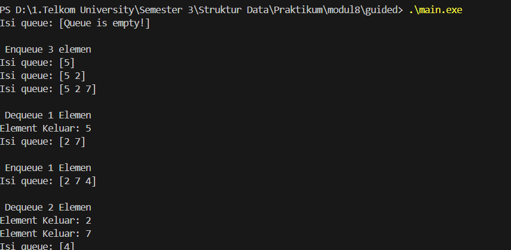
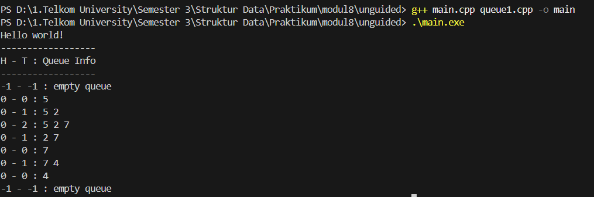
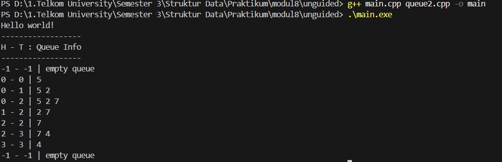
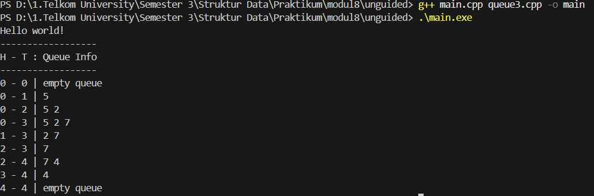

<h1 align = center > <b>  LAPORAN PRATIKUM STUKTUR DATA PERTEMUAN 2 <br>
</b></h1><p align = center><b>Nama : Alvin Aldino Rahmatullah || NIM : 103112430283 || Kelas : IF-12-05</b></p>

<h1> 1. Motivasi Belajar Struktur Data </h1>

Saya merasa mempelajari struktur data adalah pondasi awal untuk mengelola dan memahami informasi. Dengan memahami struktur data dengan baik saya merasa nantinya akan mudah menyusun program yang lebih efisien dan mampu menyelesaikan permasalahan nyata yang dihadapi, seperti pengolahan data pada aplikasi, layanan digital dan program yang mempermudah kegiatan sehari hari

<h1> 2. Dasar Teori </h1>

Queue adalah struktur data linear yang mengikuti prinsip FIFO (First-In-First-Out) dimana elemen yang pertama dimasukkan akan menjadi elemen pertama yang dikeluarkan. Analogi sederhananya seperti antrean di loket - orang yang datang pertama akan dilayani pertama.

Operasi dasar Queue:
Enqueue: Menambahkan elemen ke bagian belakang (tail) queue
Dequeue: Menghapus elemen dari bagian depan (head) queue
Front/Peek: Melihat elemen terdepan tanpa menghapusnya
isEmpty: Memeriksa apakah queue kosong
isFull: Memeriksa apakah queue penuh

<h1> 3. Guided </h1>

### Guided

**-Code Program-**

**queue.h**

```cpp

#ifndef QUEUE_H
#define QUEUE_H

#define MAX_QUEUE 5

struct Queue
{
    int info[MAX_QUEUE];
    int head;
    int tail;
    int count;
};


void createQueue(Queue &Q);
bool isEmpty(Queue Q);
bool isFull(Queue Q);
void enqueue(Queue &Q, int X);
int dequeue(Queue &Q);
void printInfo(Queue Q);
#endif

```

**queue.cpp**

```cpp

#include "queue.h"
#include <iostream>

using namespace std;

//Definisi prosedur untuk membuat queue kosong
void createQueue(Queue &Q)
{
    Q.head = 0;
    Q.tail = 0;
    Q.count = 0; // Set jumlah elemen menjadi 0
}

//Definisi fungsi untuk memeriksa apakah queue kosong
bool isEmpty(Queue Q)
{
    return Q.count == 0; // Queue kosong jika count adalah 0
}

//Definisi fungsi untuk memeriksa apakah queue penuh
bool isFull(Queue Q)
{
    return Q.count == MAX_QUEUE; // Kembali true jika count mencapai kapasitas maksimum
}

//Definisi prosedur untuk menambahkan elemen ke dalam queue
void enqueue(Queue &Q, int X)
{
    if (!isFull(Q)) // jika queue tidak penuh
    {
        Q.info[Q.tail] = X; // masukkan data x ke posisi tail
        // pindahkan ekor secara memutar (circular)
        Q.tail = (Q.tail + 1) % MAX_QUEUE; // Update tail dengan wrap-around
        Q.count++; // Increment jumlah elemen
    }
    else // jika queue penuh
    {
        cout << "Queue is full!" << endl; // tampilkan pesan queue penuh
    }
}

//Definisi fungsi untuk menghapus elemen dari dalam queue
int dequeue(Queue &Q)
{
    if (!isEmpty(Q)) // jika queue tidak kosong
    {
        int X = Q.info[Q.head]; // ambil data dari posisi head
        // pindahkan kepala secara memutar (circular)
        Q.head = (Q.head + 1) % MAX_QUEUE; // Update head dengan wrap-around
        Q.count--; // Decrement jumlah elemen
        return X; // kembalikan nilai yang di dequeue
    }
    else // jika queue kosong
    {
        cout << "Queue is empty!" << endl; // tampilkan pesan queue kosong
        return -1; // kembalikan nilai indikasi error
    }
}

void printInfo(Queue Q)
{
    cout << "Isi queue: [";
    if (!isEmpty(Q))
    {
        int i = Q.head; // mulai dari head
        int n = 0; // menghitung jumlah elemen yang sudah dicetak
        while (n < Q.count) // ulangi sebanyak jumlah elemen dalam queue
        {
            cout << Q.info[i];
            if (n < Q.count - 1) {
                cout << " "; // tambah spasi antara elemen kecuali elemen terakhir
            }
            i = (i + 1) % MAX_QUEUE; // Update indeks dengan wrap-around
            n++; // tambah penghitung
        }
    }
    else
    {
        cout << "Queue is empty!"; // pesan jika queue kosong
    }
    cout << "]" << endl;
}

```

**main.cpp**

```cpp

#include<iostream>
#include"queue.h"

using namespace std;

int main() {
    Queue Q;
    createQueue(Q);
    printInfo(Q);

    cout << "\n Enqueue 3 elemen"<< endl; 
    enqueue(Q, 5);
    printInfo(Q);
    enqueue(Q, 2);
    printInfo(Q);
    enqueue(Q, 7);
    printInfo(Q);

    cout << "\n Dequeue 1 Elemen " << endl;
    cout << "Element Keluar: " << dequeue(Q) << endl; 
    printInfo(Q);
    
    cout << "\n Enqueue 1 Elemen " << endl;
    enqueue(Q, 4);
    printInfo(Q);

    cout << "\n Dequeue 2 Elemen " << endl; 
    cout << "Element Keluar: " << dequeue(Q) << endl; 
    cout << "Element Keluar: " << dequeue(Q) << endl; 
    printInfo(Q);

    return 0;
}

```

**-Penjelasan Umum-**

Program Queue menggunakan array circular dengan kapasitas maksimal 5 elemen. Queue memiliki operasi dasar seperti createQueue untuk inisialisasi, enqueue untuk menambah elemen di belakang, dequeue untuk menghapus elemen di depan, serta fungsi printInfo untuk menampilkan isi queue. Pada main program, dilakukan serangkaian operasi enqueue dan dequeue yang dimulai dengan queue kosong, kemudian diisi elemen 5, 2, 7, dikeluarkan elemen 5, ditambah elemen 4, dan dikeluarkan elemen 2 dan 7, sehingga akhirnya queue berisi [4]. Operasi queue bekerja sesuai prinsip FIFO (First-In-First-Out) dengan menggunakan pendekatan circular array untuk efisiensi memory.

**-Output-**




<h1>4. Unguided</h1>

**-Code Program-**

**queue.h**

```cpp

#ifndef QUEUE_H 
#define QUEUE_H

#include <iostream>
using namespace std;

#define MAX_QUEUE 5
typedef int infotype; 

struct Queue {
    infotype info[MAX_QUEUE]; // Array untuk menyimpan elemen queue
    int head; // Indeks untuk elemen depan queue
    int tail; // Indeks untuk elemen belakang queue
    int count; // Penghitung jumlah elemen dalam queue
};

void createQueue(Queue &Q); // Fungsi untuk inisialisasi queue kosong
bool isEmptyQueue(Queue Q); // Fungsi untuk cek apakah queue kosong
bool isFullQueue(Queue Q); // Fungsi untuk cek apakah queue penuh
void enqueue(Queue &Q, infotype x); // Fungsi untuk menambah elemen
void printInfo(Queue Q); // Fungsi untuk menampilkan isi queue
infotype dequeue(Queue &Q); // Fungsi untuk menghapus dan mengembalikan elemen
#endif

```

**main.cpp**

```cpp

#include <iostream>
#include "queue.h"
using namespace std;

int main() {
    cout << "Hello world!" << endl; 
    
    Queue Q; // Deklarasi variabel
    createQueue(Q); // Memanggil fungsi 
    
    cout << "------------------" << endl;
    cout << "H - T : Queue Info" << endl; 
    cout << "------------------" << endl;
    printInfo(Q); // Menampilkan kondisi awal queue (kosong)
    enqueue(Q, 5); printInfo(Q);  // Menambah elemen 5 dan tampilkan queue
    enqueue(Q, 2); printInfo(Q);  // Menambah elemen 2 dan tampilkan queue
    enqueue(Q, 7); printInfo(Q);  // Menambah elemen 7 dan tampilkan queue
    dequeue(Q); printInfo(Q); // Menghapus elemen depan dan tampilkan queue
    dequeue(Q); printInfo(Q); // Menghapus elemen depan dan tampilkan queue
    enqueue(Q, 4); printInfo(Q);  // Menambah elemen 4 dan tampilkan queue
    dequeue(Q); printInfo(Q); // Menghapus elemen depan dan tampilkan queue
    dequeue(Q); printInfo(Q); // Menghapus elemen depan dan tampilkan queue
    return 0; 
}

```

**Note**
Pada Unguided soal meminta perubahan pada queue saja, sehingga laporan praktikum kali ini memiliki queue.cpp yang berbeda, sesuai dengan perintah pada soal dan queue.h serta main.cpp tidak ada perubahan maka mereka hanya ada 1 file saja.


**-Code Program queue.cpp-**


**queue1.cpp**

```cpp
#include "queue.h"

void createQueue(Queue &Q) {
    Q.head = -1; // Inisialisasi head ke -1 (menandakan queue kosong)
    Q.tail = -1; // Inisialisasi tail ke -1 (menandakan queue kosong)
}

bool isEmptyQueue(Queue Q) {
    return Q.tail == -1; // Queue kosong jika tail = -1
}

bool isFullQueue(Queue Q) {
    return Q.tail == MAX_QUEUE - 1; // Queue penuh jika tail mencapai indeks terakhir array
}

void enqueue(Queue &Q, infotype x) {
    if (isFullQueue(Q)) {
        cout << "Antrian ini sudah penuh" << endl; // Tampilkan pesan jika queue penuh
    } else {
        if (isEmptyQueue(Q)) {
            Q.head = 0; // Jika queue kosong, set head ke 0
        }
        Q.tail++; // Pindahkan tail ke posisi berikutnya
        Q.info[Q.tail] = x; // Simpan nilai x di posisi tail
    }
}

infotype dequeue(Queue &Q) {
    if (isEmptyQueue(Q)) {
        cout << "Antrian kosong" << endl; // Tampilkan pesan jika queue kosong
        return -1; // Return -1 sebagai indikator error
    } else {
        infotype x = Q.info[Q.head]; // Ambil nilai dari posisi head
        for (int i = Q.head; i < Q.tail; i++) {
            Q.info[i] = Q.info[i + 1]; // Geser semua elemen ke kiri (ke depan)
        }
        Q.tail--; // Kurangi tail karena satu elemen dikeluarkan
        if (Q.tail == -1) { 
            Q.head = -1;    // Jika queue menjadi kosong, reset head ke -1
        }
        return x; // Kembalikan nilai yang di-dequeue
    }
}

void printInfo(Queue Q) {
    cout << Q.head << " - " << Q.tail << " : "; // Tampilkan posisi head dan tail
    if (isEmptyQueue(Q)) {
        cout << "empty queue" << endl; // Tampilkan pesan queue kosong
    } else {
        for (int i = Q.head; i <= Q.tail; i++) {
            cout << Q.info[i]; // Tampilkan elemen queue
            if (i < Q.tail) {
                cout << " "; // Tambah spasi antara elemen kecuali elemen terakhir
            }
        }
        cout << endl; // Pindah baris setelah menampilkan semua elemen
    }
}
```

**-Penjelasan Umum-**

Program Queue memiliki operasi dasar seperti createQueue, enqueue, dequeue, dan printInfo. Implementasi ini menggunakan pendekatan non-circular dimana elemen akan bergeser ke depan setiap kali dequeue dilakukan. Pada output akan ditampilkan posisi head dan tail serta isi queue saat ini.

**-Output-**




**queue2.cpp**

```cpp

#include "queue.h"

void createQueue(Queue &Q) {
    Q.head = -1; // Inisialisasi head ke -1 (queue kosong)
    Q.tail = -1; // Inisialisasi tail ke -1 (queue kosong)
}

bool isEmptyQueue(Queue Q) {
    return Q.tail == -1 || Q.head > Q.tail; // Queue kosong jika tail = -1 ATAU head melebihi tail
}

bool isFullQueue(Queue Q) {
    return Q.tail == MAX_QUEUE - 1; // Queue penuh jika tail mencapai indeks terakhir array
}

void enqueue(Queue &Q, infotype x) {
    if (isFullQueue(Q)) {
        cout << "Antrian ini sudah penuh" << endl; // Tampilkan pesan jika queue penuh
    } else {
        if (isEmptyQueue(Q)) {
            Q.head = 0; // Jika queue kosong, set head ke 0
        }
        Q.tail++; // Geser tail ke posisi berikutnya
        Q.info[Q.tail] = x; // Simpan nilai x di posisi tail
    }
}

infotype dequeue(Queue &Q) {
    if (isEmptyQueue(Q)) {
        cout << "Antrian kosong" << endl; // Tampilkan pesan jika queue kosong
        return -1; // Return -1 sebagai indikator error
    } else {
        infotype x = Q.info[Q.head]; // Ambil nilai dari posisi head
        Q.head++; // Geser head ke posisi berikutnya (tanpa menghapus elemen)
        if (Q.head > Q.tail) { // Jika head melebihi tail (queue kosong)
            Q.head = -1;       // Reset head ke -1
            Q.tail = -1;       // Reset tail ke -1
        }
        return x; // Kembalikan nilai yang di-dequeue
    }
}

void printInfo(Queue Q) {
    cout << Q.head << " - " << Q.tail << " | "; // Tampilkan posisi head dan tail
    if (isEmptyQueue(Q)) {
        cout << "empty queue" << endl; // Tampilkan pesan queue kosong
    } else {
        for (int i = Q.head; i <= Q.tail; i++) {
            cout << Q.info[i] << " "; // Tampilkan elemen queue dari head ke tail
        }
        cout << endl; // Pindah baris setelah menampilkan semua elemen
    }
}

```

**-Penjelasan Umum-**

Berbeda dengan Queue1 , Queue2 hanya menggeser pointer head. Implementasi ini lebih efisien karena menghindari operasi pergeseran elemen saat dequeue

**-Output-**




**queue3.cpp**

```cpp

#include "queue.h"

void createQueue(Queue &Q) {
    Q.head = 0;    // Inisialisasi head di posisi 0
    Q.tail = 0;    // Inisialisasi tail di posisi 0 (queue kosong)
}

bool isEmptyQueue(Queue Q) {
    return Q.head == Q.tail;  // Queue kosong ketika head dan tail bertemu
}

bool isFullQueue(Queue Q) {
    return (Q.tail + 1) % MAX_QUEUE == Q.head;  // Queue penuh jika tail+1 (dengan modulus) sama dengan head
}

void enqueue(Queue &Q, infotype x) {
    if (isFullQueue(Q)) {
        cout << "Antrean Penuh!" << endl;  // Tidak bisa menambah elemen jika queue penuh
    } else {
        Q.info[Q.tail] = x;  // Simpan elemen di posisi tail saat ini
        Q.tail = (Q.tail + 1) % MAX_QUEUE;  // Geser tail dengan operasi modulus untuk circular movement
    }
}

infotype dequeue(Queue &Q) {
    if (isEmptyQueue(Q)) {
        cout << "Antrean Kosong!" << endl;  // Tidak bisa mengambil elemen dari queue kosong
        return -1;  // Nilai error
    } else {
        infotype x = Q.info[Q.head];  // Ambil elemen dari posisi head
        Q.head = (Q.head + 1) % MAX_QUEUE;  // Geser head dengan operasi modulus
        return x;  // Kembalikan elemen yang diambil
    }
}

void printInfo(Queue Q) {
    cout << Q.head << " - " << Q.tail << " | ";  // Tampilkan posisi head dan tail
    if (isEmptyQueue(Q)) {
        cout << "empty queue" << endl;  // Tampilkan status queue kosong
    } else {
        int i = Q.head;  // Mulai dari head
        while (i != Q.tail) {  // Iterasi sampai mencapai tail
            cout << Q.info[i] << " ";  // Tampilkan elemen
            i = (i + 1) % MAX_QUEUE;  // Pindah ke elemen berikutnya dengan circular movement
        }
        cout << endl;
    }
}

```

**-Penjelasan Umum-**

Berbeda dengan dua implementasi sebelumnya, Queue3 berkerja ketika pointer mencapai akhir array, ia akan kembali ke awal secara otomatis. Implementasi ini mengatasi keterbatasan memori dengan memanfaatkan kembali slot yang telah dikosongkan, menjadikannya sangat efisien untuk aplikasi yang membutuhkan operasi enqueue dan dequeue berulang.

**-Output-**




<h1> 6. Referensi </h1>

1. https://www.geeksforgeeks.org/queue-data-structure/
2. https://www.programiz.com/dsa/circular-queue
3. https://www.tutorialspoint.com/data_structures_algorithms/queue_algorithm.htm
4. https://www.javatpoint.com/queue-implementation